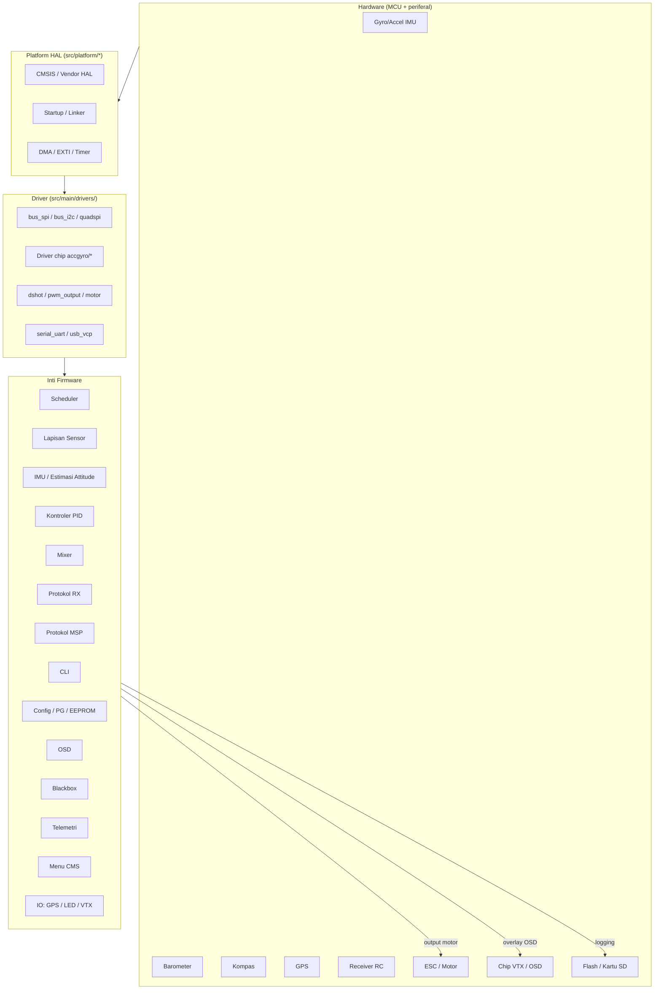
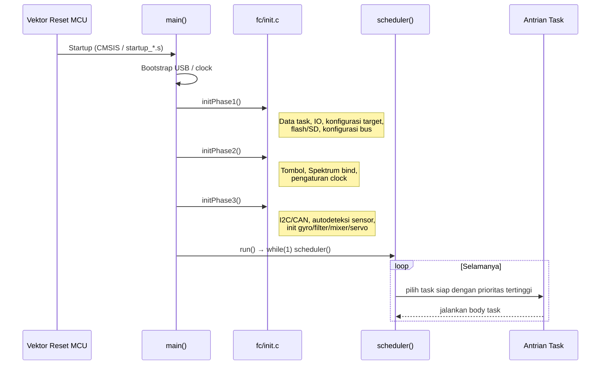
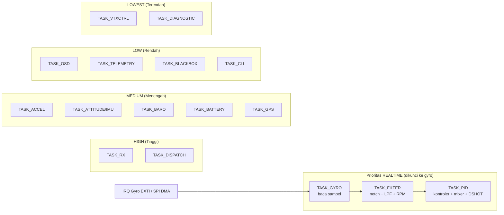
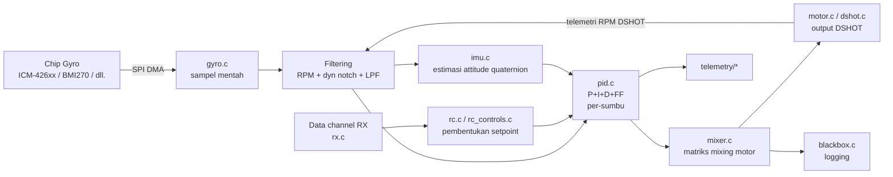
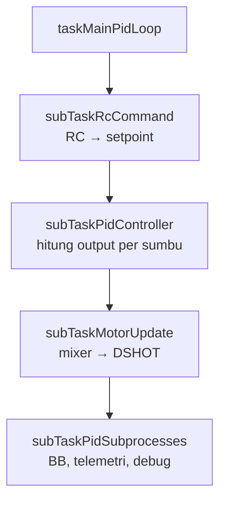
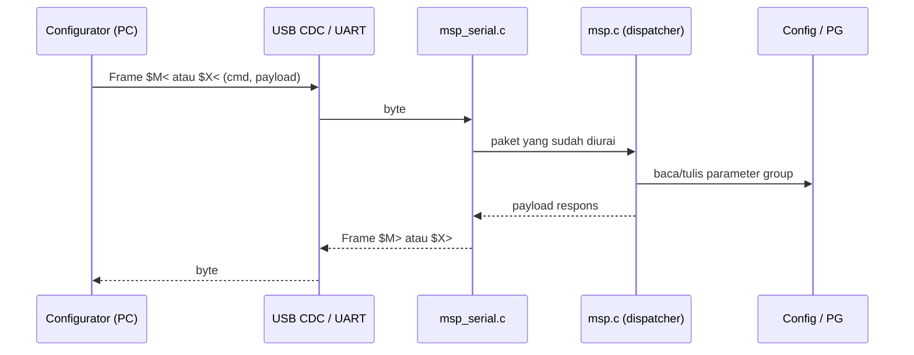
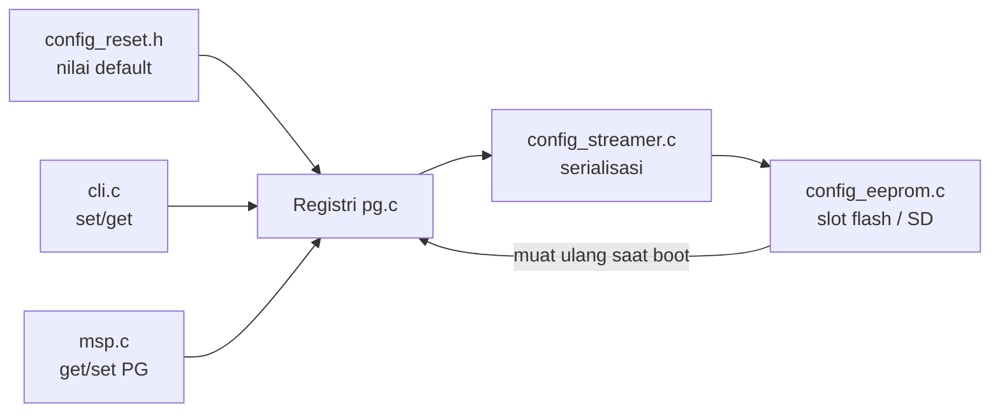
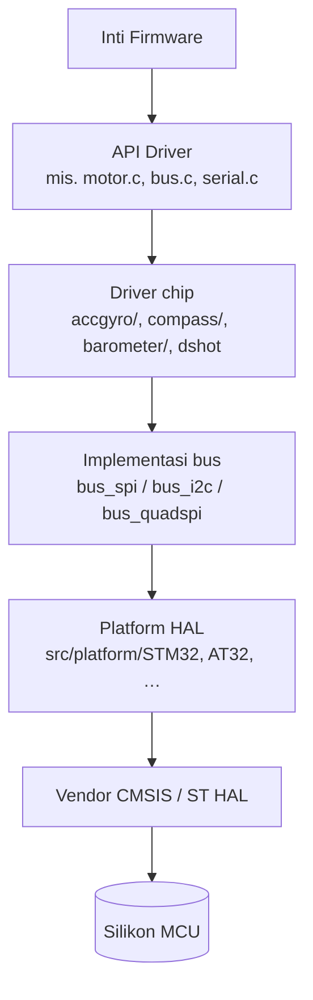

# Betaflight Firmware — Ringkasan Arsitektur & Source Code

Tinjauan teknis komprehensif firmware flight controller [Betaflight](https://github.com/betaflight/betaflight), dihasilkan dari Tree Analysis dari sumber di `src/`.

---

## 1. Gambaran Proyek

**Betaflight** adalah firmware flight controller (FC) open-source yang utamanya ditujukan untuk pesawat **multi-rotor** (dan fixed-wing). Fokusnya pada stabilisasi latensi rendah, dukungan hardware yang luas, dan fitur-fitur kaya (OSD, blackbox, GPS rescue, dynamic filtering, dll.). Lisensi: **GPL v3**.

**Keluarga MCU yang didukung** (di bawah [src/platform/](betaflight/src/platform)):

| Keluarga | Catatan |
|---|---|
| STM32 F4 / F7 / G4 / H7 | Utama, paling banyak digunakan |
| STM32 C5 / H5 / N6 | Varian ST yang lebih baru |
| AT32 F43x | Klon Artery dari STM32 |
| APM32 F4, GD32 F4 | Klon Geehy / GigaDevice |
| PICO (RP2040) | Raspberry Pi Pico |
| ESP32 | Eksperimental |
| SIMULATOR / SITL | Software-in-the-loop (simulasi) |

---

## 2. Arsitektur Tingkat Tinggi



### Tata Letak Sumber Tingkat Atas (`src/main/`)

| Direktori | Fungsi |
|---|---|
| [blackbox/](betaflight/src/main/blackbox) | Perekam data penerbangan kecepatan tinggi (flash/SD) |
| [build/](betaflight/src/main/build) | Metadata build, operasi atomik, debug pin |
| [cli/](betaflight/src/main/cli) | Antarmuka command-line interaktif |
| [cms/](betaflight/src/main/cms) | Sistem Menu Konfigurasi (menu dalam OSD) |
| [common/](betaflight/src/main/common) | Utilitas: matematika, filter, warna, waktu, string |
| [config/](betaflight/src/main/config) | Inti konfigurasi, EEPROM, flag fitur |
| [drivers/](betaflight/src/main/drivers) | Abstraksi hardware (~80+ file) |
| [fc/](betaflight/src/main/fc) | Inti flight controller: init, RC, arming, task |
| [flight/](betaflight/src/main/flight) | PID, mixer, IMU, failsafe, GPS rescue, autopilot |
| [io/](betaflight/src/main/io) | GPS, LED strip, VTX, gimbal, displayport, serial |
| [msc/](betaflight/src/main/msc) | USB Mass Storage Class (emulasi FAT) |
| [msp/](betaflight/src/main/msp) | MultiWii Serial Protocol (koneksi ke configurator) |
| [osd/](betaflight/src/main/osd) | Elemen On-Screen Display & peringatan |
| [pg/](betaflight/src/main/pg) | Parameter Groups (registri konfigurasi berversi) |
| [rx/](betaflight/src/main/rx) | Protokol receiver (SBUS, CRSF, ELRS, …) |
| [scheduler/](betaflight/src/main/scheduler) | Penjadwal task kooperatif real-time |
| [sensors/](betaflight/src/main/sensors) | Sensor gyro/accel/baro/kompas/baterai/ESC |
| [target/](betaflight/src/main/target) | Definisi board target (legacy + unified) |
| [telemetry/](betaflight/src/main/telemetry) | Protokol output telemetri |

---

## 3. Alur Boot & Inisialisasi

Titik masuk berada di [src/main/main.c](betaflight/src/main/main.c). Inisialisasi dibagi menjadi tiga fase di dalam [src/main/fc/init.c](betaflight/src/main/fc/init.c).



File-file kunci:
- [src/main/main.c](betaflight/src/main/main.c) — `main()` dan `run()`
- [src/main/fc/init.c](betaflight/src/main/fc/init.c) — `initPhase1/2/3()`
- [src/main/fc/tasks.c](betaflight/src/main/fc/tasks.c) — tabel task & registrasi
- [src/main/fc/runtime_config.c](betaflight/src/main/fc/runtime_config.c) — status armed/mode penerbangan

---

## 4. Penjadwal Real-Time Kooperatif

Diimplementasikan di [src/main/scheduler/scheduler.c](betaflight/src/main/scheduler/scheduler.c). Task disimpan dalam antrian prioritas; rantai gyro/filter/PID **dikunci pada interrupt sampel gyro** untuk latensi yang deterministik.



**Frekuensi loop** diatur oleh `pid_process_denom`:
- Tipikal: gyro 8 kHz, PID 4 kHz (denom = 2).
- Dapat dipilih: PID 1, 2, 4, atau 8 kHz.

Task berbasis event memiliki callback `checkFunc()` (mis. RX, OSD) — scheduler memanggilnya hanya saat anggaran CPU tersedia.

---

## 5. Pipeline Kontrol Penerbangan

Aliran data end-to-end per iterasi PID (dijalankan oleh sub-task di [core.c](betaflight/src/main/fc/core.c)):



File-file penting:
- [src/main/sensors/gyro.c](betaflight/src/main/sensors/gyro.c) — sampling, kalibrasi, masuk rantai filter
- [src/main/flight/imu.c](betaflight/src/main/flight/imu.c) — fusi sensor / estimasi attitude
- [src/main/flight/pid.c](betaflight/src/main/flight/pid.c) — PID + feed-forward + iterm relax + anti-gravity
- [src/main/flight/mixer.c](betaflight/src/main/flight/mixer.c) — mixing motor, batas throttle, idle
- [src/main/flight/rpm_filter.c](betaflight/src/main/flight/rpm_filter.c) — notch per-motor dari telemetri DSHOT
- [src/main/flight/dyn_notch_filter.c](betaflight/src/main/flight/dyn_notch_filter.c) — notch dinamis berbasis FFT
- [src/main/flight/failsafe.c](betaflight/src/main/flight/failsafe.c) — penanganan kehilangan sinyal RC
- [src/main/flight/gps_rescue_multirotor.c](betaflight/src/main/flight/gps_rescue_multirotor.c) — return-to-home
- [src/main/flight/alt_hold_multirotor.c](betaflight/src/main/flight/alt_hold_multirotor.c), [pos_hold_multirotor.c](betaflight/src/main/flight/pos_hold_multirotor.c), [autopilot_multirotor.c](betaflight/src/main/flight/autopilot_multirotor.c) — mode terbang dibantu

### Detail Internal Task PID Utama



---

## 6. Sensor

Terletak di [src/main/sensors/](betaflight/src/main/sensors). Pembungkus tingkat tinggi dari driver chip di [src/main/drivers/](betaflight/src/main/drivers).

| File | Peran |
|---|---|
| [gyro.c](betaflight/src/main/sensors/gyro.c), [gyro_init.c](betaflight/src/main/sensors/gyro_init.c) | Pipeline gyro & pengaturan filter |
| [acceleration.c](betaflight/src/main/sensors/acceleration.c) | Akselerometer + kalibrasi |
| [compass.c](betaflight/src/main/sensors/compass.c) | Magnetometer / kompas |
| [barometer.c](betaflight/src/main/sensors/barometer.c) | Ketinggian berbasis tekanan udara |
| [battery.c](betaflight/src/main/sensors/battery.c) | Monitor tegangan / arus baterai |
| [opticalflow.c](betaflight/src/main/sensors/opticalflow.c) | Sensor optical flow |
| [rangefinder.c](betaflight/src/main/sensors/rangefinder.c) | Sensor jarak (lidar / sonar) |
| [esc_sensor.c](betaflight/src/main/sensors/esc_sensor.c) | Telemetri ESC (RPM, suhu) |
| [boardalignment.c](betaflight/src/main/sensors/boardalignment.c) | Kompensasi orientasi mounting FC |

Driver tingkat chip ada di subfolder seperti [drivers/accgyro/](betaflight/src/main/drivers/accgyro), [drivers/compass/](betaflight/src/main/drivers/compass), [drivers/barometer/](betaflight/src/main/drivers/barometer).

---

## 7. Protokol RX (Receiver)

[src/main/rx/](betaflight/src/main/rx) mendukung berbagai protokol RC, didistribusikan dari [rx.c](betaflight/src/main/rx/rx.c):

| Protokol | File |
|---|---|
| SBUS | [sbus.c](betaflight/src/main/rx/sbus.c) |
| CRSF / ELRS | [crsf.c](betaflight/src/main/rx/crsf.c), [expresslrs.c](betaflight/src/main/rx/expresslrs.c) |
| Spektrum / SRXL2 | [spektrum.c](betaflight/src/main/rx/spektrum.c), [srxl2.c](betaflight/src/main/rx/srxl2.c) |
| FrSky D / X (CC2500) | [cc2500_frsky_d.c](betaflight/src/main/rx/cc2500_frsky_d.c), [cc2500_frsky_x.c](betaflight/src/main/rx/cc2500_frsky_x.c) |
| FlySky (A7105) | [a7105_flysky.c](betaflight/src/main/rx/a7105_flysky.c) |
| iBUS | [ibus.c](betaflight/src/main/rx/ibus.c) |
| GHST | [ghst.c](betaflight/src/main/rx/ghst.c) |
| Jeti ExBus | [jetiexbus.c](betaflight/src/main/rx/jetiexbus.c) |
| SumD / SumH | [sumd.c](betaflight/src/main/rx/sumd.c), [sumh.c](betaflight/src/main/rx/sumh.c) |
| PWM / PPM | [pwm.c](betaflight/src/main/rx/pwm.c) |
| MAVLink | [mavlink.c](betaflight/src/main/rx/mavlink.c) |
| MSP override | [msp_override.c](betaflight/src/main/rx/msp_override.c) |

---

## 8. MSP — Protokol Configurator

Protokol biner perintah/respons yang digunakan oleh **Betaflight Configurator**, passthrough BLHeli, dan banyak alat ground station.



File: [msp.c](betaflight/src/main/msp/msp.c), [msp_serial.c](betaflight/src/main/msp/msp_serial.c), [msp_box.c](betaflight/src/main/msp/msp_box.c), [msp_protocol_v2_betaflight.h](betaflight/src/main/msp/msp_protocol_v2_betaflight.h).

---

## 9. Konfigurasi & Parameter Groups (PG)

Konfigurasi diorganisir sebagai **kelompok parameter berversi** yang didaftarkan saat link-time. Setiap domain (motor, perangkat gyro, RX, board, ADC, …) memiliki PG sendiri dengan nilai default dan validasi CRC.



File: [pg/pg.c](betaflight/src/main/pg/pg.c), [config/config.c](betaflight/src/main/config/config.c), [config/config_eeprom.c](betaflight/src/main/config/config_eeprom.c), [config/config_streamer.c](betaflight/src/main/config/config_streamer.c), [config/feature.c](betaflight/src/main/config/feature.c), [cli/cli.c](betaflight/src/main/cli/cli.c), [cli/settings.h](betaflight/src/main/cli/settings.h).

---

## 10. OSD, Blackbox, Telemetri, CMS

| Subsistem | Fungsi | File utama |
|---|---|---|
| **OSD** | Overlay metrik pada tautan video analog/HD | [osd/osd.c](betaflight/src/main/osd/osd.c), [osd/osd_elements.c](betaflight/src/main/osd/osd_elements.c), [osd/osd_warnings.c](betaflight/src/main/osd/osd_warnings.c) |
| **Blackbox** | Logger kecepatan tinggi ke flash / SD onboard | [blackbox/blackbox.c](betaflight/src/main/blackbox/blackbox.c), [blackbox/blackbox_io.c](betaflight/src/main/blackbox/blackbox_io.c), [blackbox/blackbox_encoding.c](betaflight/src/main/blackbox/blackbox_encoding.c) |
| **Telemetri** | Streaming data real-time ke radio | [telemetry/](betaflight/src/main/telemetry) — CRSF, FrSky SmartPort, HoTT, IBUS, LTM, Jeti, SRXL, MSP |
| **CMS** | Menu konfigurasi dalam OSD via gesture stick | [cms/cms.c](betaflight/src/main/cms/cms.c), `cms_menu_*.c` (PID, OSD, failsafe, …) |

---

## 11. Driver & Platform HAL

`src/main/drivers/` menyediakan **abstraksi hardware**, sementara `src/platform/<MCU>/` menyediakan spesifik vendor MCU (CMSIS, startup, linker, tabel DMA stream).



Sorotan:
- **Bus**: [bus.c](betaflight/src/main/drivers/bus.c), [bus_spi.c](betaflight/src/main/drivers/bus_spi.c), [bus_i2c_impl.h](betaflight/src/main/drivers/bus_i2c_impl.h), [bus_quadspi.c](betaflight/src/main/drivers/bus_quadspi.c), [bus_octospi.c](betaflight/src/main/drivers/bus_octospi.c)
- **Motor**: [motor.c](betaflight/src/main/drivers/motor.c), [dshot.c](betaflight/src/main/drivers/dshot.c), [pwm_output.c](betaflight/src/main/drivers/pwm_output.c)
- **Chip IMU**: [drivers/accgyro/](betaflight/src/main/drivers/accgyro) (ICM-206xx, ICM-426xx, BMI160/270, MPU6xxx, …)

---

## 12. Sistem Build

[Makefile](betaflight/Makefile) tingkat atas beserta modul-modul di [mk/](betaflight/mk).

| File | Peran |
|---|---|
| [Makefile](betaflight/Makefile) | Orkestrator utama |
| [mk/config.mk](betaflight/mk/config.mk) | Pengaturan target & path |
| [mk/source.mk](betaflight/mk/source.mk) | Pengumpulan sumber / aturan kompilasi |
| [mk/tools.mk](betaflight/mk/tools.mk) | Penemuan ARM GCC + ccache |
| [mk/checks.mk](betaflight/mk/checks.mk) | Pemeriksaan sanitasi pra-build |
| [mk/dronecan.mk](betaflight/mk/dronecan.mk) | Pustaka DroneCAN opsional |
| [mk/linux.mk](betaflight/mk/linux.mk), [mk/macosx.mk](betaflight/mk/macosx.mk), [mk/windows.mk](betaflight/mk/windows.mk) | Spesifik OS host |

Perintah umum:

```bash
make TARGET=STM32F7X2          # Build target unified
make TARGET=SITL               # Build software-in-the-loop
make targets                   # Daftar semua target tersedia
make clean_all
```

Target ditemukan secara otomatis dari `src/platform/*/target/*/target.mk`.

---

## 13. Daftar File Penting (Cheat-Sheet)

| Kepentingan | File |
|---|---|
| Titik masuk | [src/main/main.c](betaflight/src/main/main.c) |
| Fase inisialisasi | [src/main/fc/init.c](betaflight/src/main/fc/init.c) |
| Tabel task | [src/main/fc/tasks.c](betaflight/src/main/fc/tasks.c) |
| Penjadwal | [src/main/scheduler/scheduler.c](betaflight/src/main/scheduler/scheduler.c) |
| Sub-task loop utama | [src/main/fc/core.c](betaflight/src/main/fc/core.c) |
| Status runtime / arm | [src/main/fc/runtime_config.c](betaflight/src/main/fc/runtime_config.c) |
| Pipeline gyro | [src/main/sensors/gyro.c](betaflight/src/main/sensors/gyro.c) |
| Attitude (IMU) | [src/main/flight/imu.c](betaflight/src/main/flight/imu.c) |
| Kontroler PID | [src/main/flight/pid.c](betaflight/src/main/flight/pid.c) |
| Mixer | [src/main/flight/mixer.c](betaflight/src/main/flight/mixer.c) |
| Dispatcher RX | [src/main/rx/rx.c](betaflight/src/main/rx/rx.c) |
| Dispatcher MSP | [src/main/msp/msp.c](betaflight/src/main/msp/msp.c) |
| Registri konfigurasi | [src/main/pg/pg.c](betaflight/src/main/pg/pg.c) |
| Penyimpanan EEPROM | [src/main/config/config_eeprom.c](betaflight/src/main/config/config_eeprom.c) |
| Blackbox | [src/main/blackbox/blackbox.c](betaflight/src/main/blackbox/blackbox.c) |
| OSD | [src/main/osd/osd.c](betaflight/src/main/osd/osd.c) |
| Failsafe | [src/main/flight/failsafe.c](betaflight/src/main/flight/failsafe.c) |

---

## 14. Model Mental — Ringkasan Satu Kalimat

> **Sebuah ISR (Interrupt Service Routine) dipicu setiap sampel gyro → scheduler menjalankan gyro → filter → PID → mixer → DSHOT, semuanya dalam satu rantai deterministik yang terikat pada interrupt tersebut; semua hal lainnya (parsing RX, OSD, blackbox, MSP, telemetri, CMS, GPS) dimasukkan secara oportunistik ke dalam sisa anggaran CPU oleh scheduler kooperatif berbasis prioritas.**
