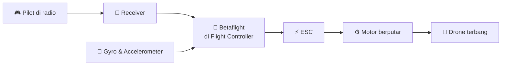
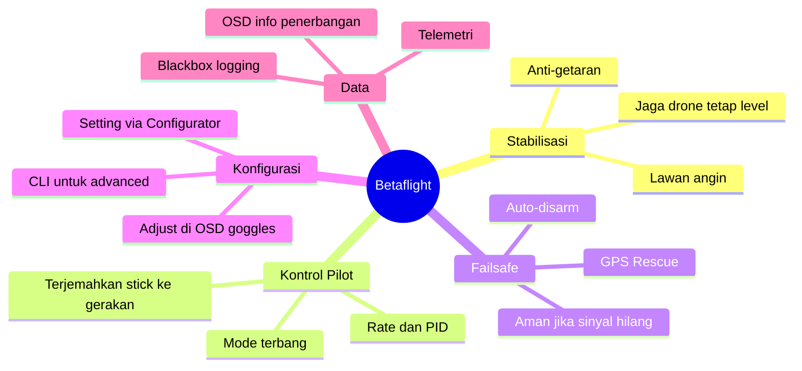
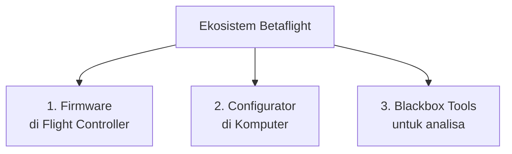
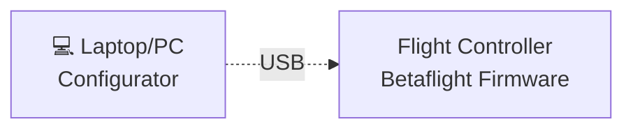
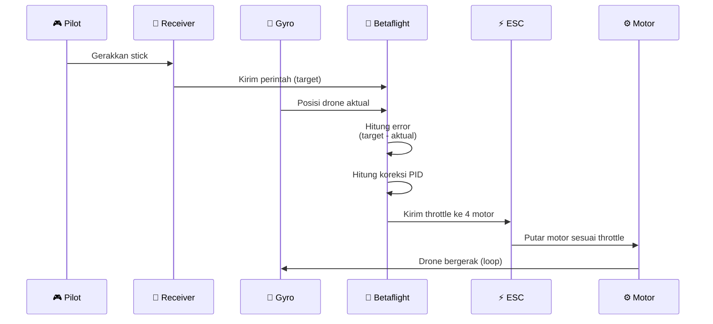
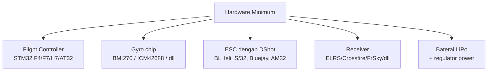
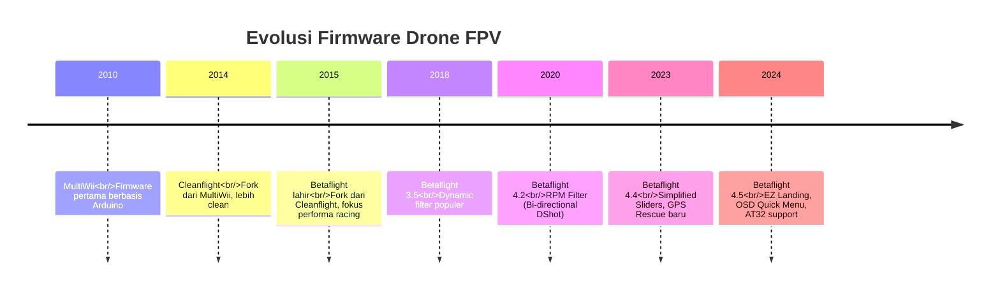
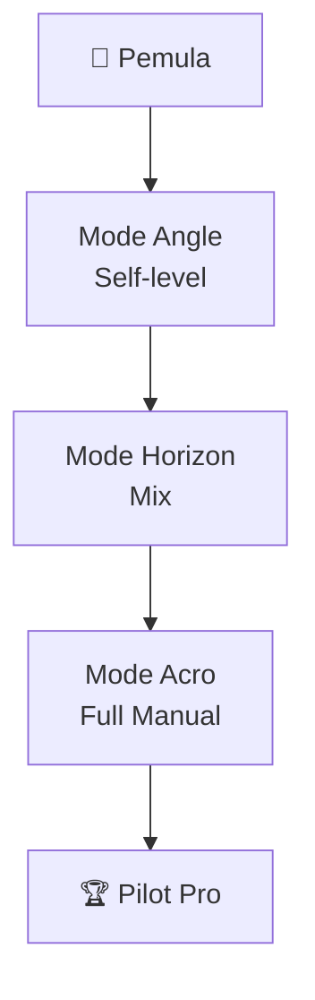
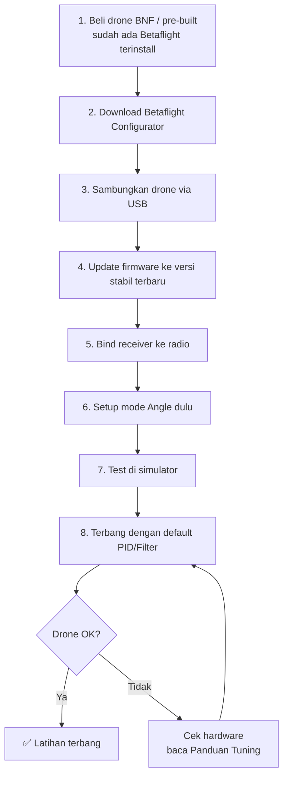

# Memahami Betaflight untuk Pemula

> 📺 **Dibuat oleh [SkyfluxFPV](https://www.instagram.com/skyfluxfpv/)** · [Instagram](https://www.instagram.com/skyfluxfpv/) · [TikTok](https://www.tiktok.com/@skyfluxfpv)
>
> Panduan **super sederhana** untuk memahami **apa itu Betaflight**.
> Tanpa istilah teknis berlebihan — cocok untuk yang baru mulai dunia FPV.
>
> **Referensi terpercaya:**
> - Website resmi Betaflight — <https://betaflight.com>
> - GitHub Betaflight — <https://github.com/betaflight/betaflight>
> - Oscar Liang — <https://oscarliang.com/betaflight/>
> - Joshua Bardwell (YouTube) — referensi komunitas

---

## Daftar Isi

1. [Apa Itu Betaflight?](#1-apa-itu-betaflight)
2. [Analogi Sederhana: Otak Drone](#2-analogi-sederhana-otak-drone)
3. [Apa yang Bisa Dilakukan Betaflight?](#3-apa-yang-bisa-dilakukan-betaflight)
4. [3 Komponen Utama Betaflight](#4-3-komponen-utama-betaflight)
5. [Cara Kerja Singkat](#5-cara-kerja-singkat)
6. [Hardware yang Dibutuhkan](#6-hardware-yang-dibutuhkan)
7. [Sejarah Singkat Betaflight](#7-sejarah-singkat-betaflight)
8. [Mode Terbang di Betaflight](#8-mode-terbang-di-betaflight)
9. [Pertanyaan yang Sering Ditanyakan](#9-pertanyaan-yang-sering-ditanyakan)
10. [Langkah Awal untuk Pemula](#10-langkah-awal-untuk-pemula)
11. [Bacaan Lanjut](#11-bacaan-lanjut)

---

## 1. Apa Itu Betaflight?

**Betaflight** adalah **firmware open-source** (perangkat lunak) yang dipasang di **flight controller** (FC) drone FPV.

> 💡 **Sederhananya:** Betaflight adalah "**sistem operasi**" untuk drone FPV — seperti Android di HP atau Windows di laptop.

Tanpa Betaflight, drone hanyalah kumpulan motor, ESC, dan baterai yang **tidak bisa terbang**. Betaflight yang **menggerakkan motor** sesuai perintah pilot dan menjaga drone tetap **stabil** di udara.

**Fakta penting:**
- ✅ **Gratis** dan **open-source** (kode bisa dilihat siapa saja).
- ✅ Komunitas besar — ribuan pilot kontribusi & sharing.
- ✅ Standar de-facto untuk drone FPV racing & freestyle.

---

## 2. Analogi Sederhana: Otak Drone

Bayangkan drone seperti **tubuh manusia**:

| Bagian Drone | Analogi Manusia |
|---|---|
| **Frame** | Kerangka tulang |
| **Motor + ESC** | Otot |
| **Baterai** | Jantung & sumber energi |
| **Gyro** | Telinga bagian dalam (keseimbangan) |
| **FPV Camera + VTX** | Mata |
| **Receiver** | Telinga (terima perintah pilot) |
| **Flight Controller + Betaflight** | 🧠 **Otak** |

> Tanpa otak, tubuh tidak bisa apa-apa. Tanpa Betaflight, drone hanya barang elektronik mati.

---

## 3. Apa yang Bisa Dilakukan Betaflight?

### Fungsi Utama:

1. **Stabilisasi** — Menjaga drone tetap di posisi sesuai keinginan pilot.
2. **Kontrol motor** — Mengirim sinyal yang tepat ke 4 motor untuk gerakan presisi.
3. **Failsafe** — Auto-protection jika sinyal radio hilang.
4. **Logging** — Rekam data terbang untuk analisa (Blackbox).
5. **OSD** — Tampilkan info (battery, RSSI, timer) di goggles FPV.
6. **Konfigurasi** — Atur ratusan parameter sesuai kebutuhan.

---

## 4. 3 Komponen Utama Betaflight

### 4.1 Firmware (.hex / .bin)

**File** yang di-flash ke chip flight controller. Inilah Betaflight yang sebenarnya — berjalan **8000 kali per detik** di FC.

- Versi terbaru: **Betaflight 4.5.x**
- Download: <https://github.com/betaflight/betaflight/releases>

### 4.2 Betaflight Configurator

**Aplikasi desktop** (Windows/Mac/Linux) untuk mengatur drone via USB cable.

- Download: <https://github.com/betaflight/betaflight-configurator/releases>
- Versi terbaru: **10.10.0+**

### 4.3 Blackbox Explorer / PIDtoolbox

**Tools analisa** untuk membaca data Blackbox (rekaman terbang) — untuk tuning lanjutan.

---

## 5. Cara Kerja Singkat

Berikut yang terjadi di drone setiap **0.125 milidetik** (8000x per detik!):

> ⚡ **8000 Hz PID Loop** — itu artinya Betaflight melakukan kalkulasi 8 ribu kali per detik!

---

## 6. Hardware yang Dibutuhkan

Betaflight bisa berjalan di banyak flight controller, tapi ada **standar minimum**:

### Komponen yang Khas di Drone Betaflight:

| Komponen | Fungsi | Contoh |
|---|---|---|
| **Flight Controller** | Tempat Betaflight berjalan | Speedybee F405, Mamba H743 |
| **Gyro** | Sensor putaran (terpasang di FC) | BMI270, ICM-42688-P |
| **ESC** | Driver motor (4 unit) | T-Motor F55A, Hobbywing 50A |
| **Motor** | Penggerak (4 unit) | Emax 2306, T-Motor F40 |
| **Receiver** | Terima sinyal radio | ELRS, TBS Crossfire |
| **VTX & Camera** | Sistem FPV | DJI O3/O4, RunCam Phoenix |

---

## 7. Sejarah Singkat Betaflight

> **Fakta menarik:** Betaflight di-maintain oleh **komunitas sukarelawan** dari seluruh dunia — bukan perusahaan! Salah satu maintainer terkenal: **ctzsnooze**, **hydra**, **blckmn**, **SteveCEvans**, **KarateBrot**, dll.

---

## 8. Mode Terbang di Betaflight

Betaflight punya beberapa mode terbang yang bisa diaktifkan via **switch** di radio:

| Mode | Deskripsi | Cocok untuk |
|---|---|---|
| **Acro** (default) | Drone tidak self-level — full kontrol pilot | Freestyle, racing |
| **Air Mode** | Tetap berikan koreksi PID meski throttle 0 — anti drop saat punch-out | Freestyle, racing (wajib aktif) |
| **Angle** | Self-level — drone otomatis kembali datar saat stick lepas | Pemula, line-of-sight |
| **Horizon** | Mix Acro & Angle — bisa flip tapi self-level di stick tengah | Transisi pemula → acro |
| **GPS Rescue** | Auto pulang ke titik takeoff (perlu modul GPS) | Failsafe / kehilangan sinyal |
| **Turtle** | Drone bisa "membalik diri" jika terbalik di tanah | Setelah crash |
| **Beeper** | Aktifkan beeper untuk cari drone yang hilang | Setelah crash di rumput |

---

## 9. Pertanyaan yang Sering Ditanyakan

### ❓ Apakah Betaflight gratis?
**Ya**, 100% gratis & open-source. Tapi hardware (FC, drone, dll) tetap harus beli.

### ❓ Apakah Betaflight bisa untuk semua drone?
**Tidak**. Betaflight khusus untuk **drone FPV** (multirotor). Untuk drone fotografi seperti DJI Mavic, mereka pakai firmware proprietary mereka sendiri.

### ❓ Apa beda Betaflight dengan iNav, Ardupilot, KISS?
| Firmware | Spesialisasi |
|---|---|
| **Betaflight** | Racing & freestyle (paling populer) |
| **iNav** | Long-range, autonomous waypoint, fixed wing |
| **Ardupilot** | Profesional, kompleks (drone industri/militer) |
| **KISS** | Simple, eksklusif untuk hardware KISS |
| **EmuFlight** | Fork Betaflight, fokus drone unik (tricopter, dll) |

### ❓ Apakah Betaflight aman untuk pemula?
**Aman** asalkan:
- Pakai **Mode Angle** dulu untuk belajar.
- Test di simulator (Liftoff, Velocidrone) sebelum terbang sungguhan.
- Selalu aktifkan **failsafe**.
- Jangan modif PID/parameter tanpa tahu efeknya.

### ❓ Apa itu "tuning" yang sering disebut?
Tuning = menyesuaikan parameter Betaflight (PID, Filter, Rate) agar drone terbang **stabil & responsif** sesuai gaya terbangmu. Lihat [Memahami PID](MEMAHAMI_PID.md) dan [Memahami Rate](MEMAHAMI_RATE.md).

### ❓ Apakah saya harus tuning sendiri?
**Tidak wajib** untuk pemula! Betaflight default sudah **sangat bagus** untuk drone 5" yang dirakit dengan benar. Tuning baru perlu jika ada masalah spesifik.

### ❓ Apakah Betaflight bisa rusak / nge-brick FC?
Bisa, tapi **jarang** terjadi. Resiko: gagal flash firmware. Solusinya: flash ulang via **DFU mode**. Komunitas sangat membantu jika ada masalah.

---

## 10. Langkah Awal untuk Pemula

### Tips Krusial Pemula:

1. **Beli drone BNF** (Bind-N-Fly) untuk mulai — sudah pre-built & pre-configured.
2. **Pelajari Configurator** dulu sebelum utak-atik (lihat tab Setup, Configuration, PID Tuning).
3. **Jangan flash firmware beta/dev** — pakai versi stable.
4. **Backup CLI dump** sebelum perubahan apapun: tab CLI → ketik `diff all` → simpan.
5. **Aktifkan failsafe** di tab Failsafe — wajib!
6. **Mulai di simulator FPV** (gratis: TRYP FPV; berbayar: Liftoff, Velocidrone).
7. **Join komunitas** — Discord Betaflight, IntoFPV forum, grup Telegram FPV Indonesia.

---

## 11. Bacaan Lanjut

### 📘 Untuk Pemula

- 🎯 [Memahami Betaflight Rate](MEMAHAMI_RATE.md) — Apa itu Rate & cara setting.
- 🧠 [Memahami PID Betaflight](MEMAHAMI_PID.md) — Apa itu PID & cara kerja stabilisasi.

### 📕 Untuk Tuning Detail

- 🔧 [Panduan Lengkap Tuning Betaflight (Bahasa Indonesia)](PANDUAN_TUNING_BETAFLIGHT.md) — Step-by-step Rate, PID, Filter, Blackbox analysis.

### 📗 Untuk Memahami Struktur Internal Betaflight

> 🧑‍💻 **Topik Lanjut (Developer/Advanced):**
>
> Untuk memahami **arsitektur internal** Betaflight (struktur source code, scheduler, task system, bagaimana firmware di-build, hubungan antar-module, dll), silakan rujuk ke:
>
> - 📖 [BETAFLIGHT_ARCHITECTURE.md](BETAFLIGHT_ARCHITECTURE.md)
>
> File ini menjelaskan internal Betaflight dengan diagram Mermaid yang lengkap, mencakup main loop, sensor pipeline, motor mixer, dll. Cocok untuk yang ingin **kontribusi ke kode Betaflight** atau memahami **cara kerja firmware di level rendah**.

### 🌐 Sumber Eksternal

- **Website Resmi** — <https://betaflight.com>
- **GitHub Source** — <https://github.com/betaflight/betaflight>
- **Discord Komunitas** — <https://discord.betaflight.com>
- **Oscar Liang Tutorials** — <https://oscarliang.com/category/betaflight/>
- **Joshua Bardwell YouTube** — channel pembelajaran FPV
- **IntoFPV Forum** — <https://intofpv.com>

---

> 🚁 **Selamat datang di dunia FPV!** Betaflight memang punya banyak pengaturan, tapi jangan terlalu cepat utak-atik. **Terbangkan drone-mu, nikmati prosesnya**, dan tuning hanya jika perlu.
>
> *"Spend more time flying, that's how you know whether your quad flies good or not."* — Oscar Liang

---

  📺 Dibuat oleh <strong>SkyfluxFPV</strong> · <a href="https://www.instagram.com/skyfluxfpv/">Instagram</a> · <a href="https://www.tiktok.com/@skyfluxfpv">TikTok</a> 
  <em>Follow untuk konten FPV</em>

