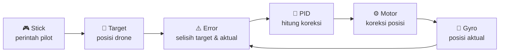
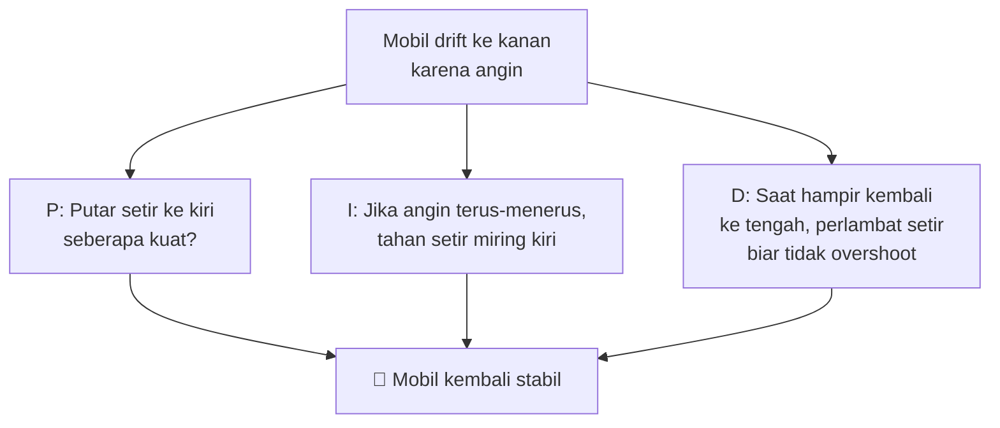
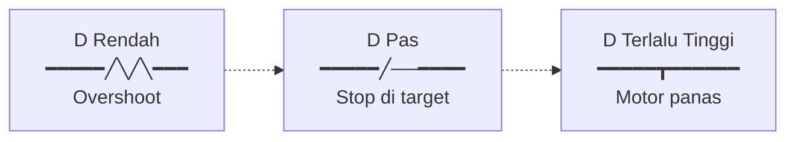
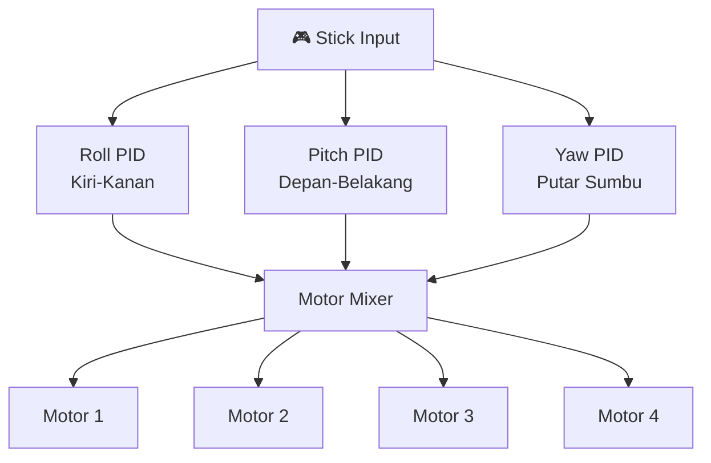
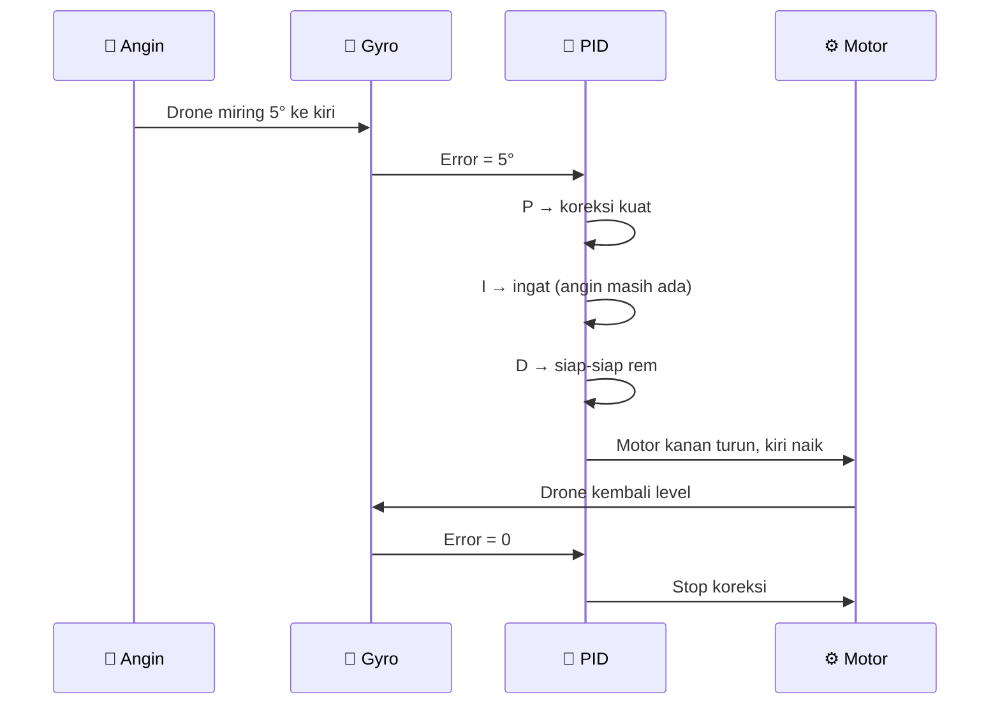
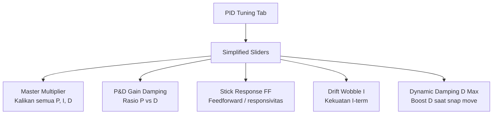
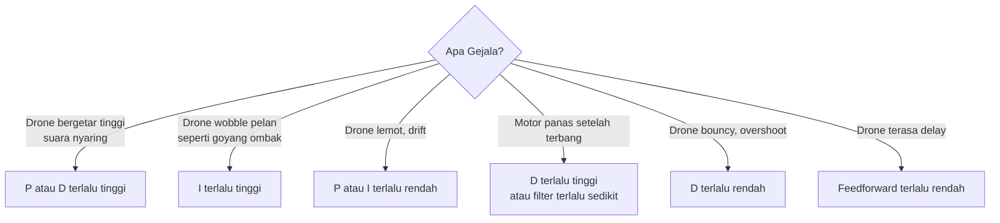
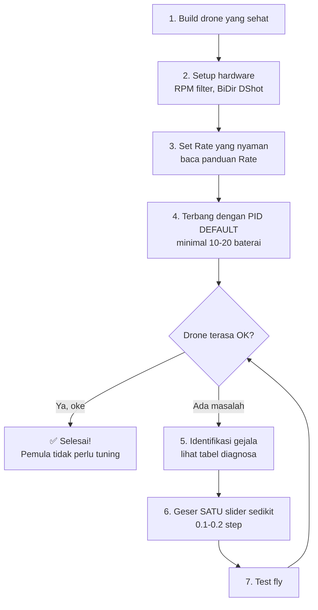
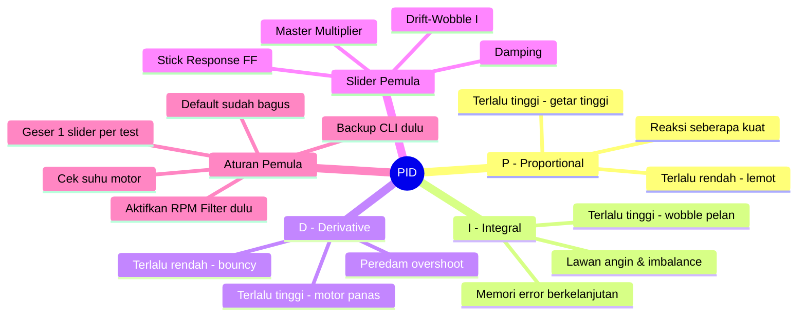

# Memahami PID Betaflight untuk Pemula

> 📺 **Dibuat oleh [SkyfluxFPV](https://www.instagram.com/skyfluxfpv/)** · [Instagram](https://www.instagram.com/skyfluxfpv/) · [TikTok](https://www.tiktok.com/@skyfluxfpv)
>
> Panduan **super sederhana** untuk memahami apa itu **PID** di Betaflight.
> Tanpa rumus matematika rumit — fokus pada **konsep & analogi**.
>
> **Referensi terpercaya:**
> - Oscar Liang — <https://oscarliang.com/pid/>
> - Oscar Liang PID/Filter Tuning — <https://oscarliang.com/pid-filter-tuning-blackbox/>
> - Dokumentasi resmi Betaflight — <https://betaflight.com>
> - Joshua Bardwell (YouTube) — referensi komunitas

---

## Daftar Isi

1. [Apa Itu PID?](#1-apa-itu-pid)
2. [Analogi: Pengemudi Mobil](#2-analogi-pengemudi-mobil)
3. [Penjelasan P, I, D Satu per Satu](#3-penjelasan-p-i-d-satu-per-satu)
4. [Bagaimana PID Bekerja di Drone?](#4-bagaimana-pid-bekerja-di-drone)
5. [Contoh Konkret: Drone Diserang Angin](#5-contoh-konkret-drone-diserang-angin)
6. [Apa Itu Slider PID di Betaflight?](#6-apa-itu-slider-pid-di-betaflight)
7. [Parameter PID Lanjutan (FF, D_Min, TPA, dll)](#7-parameter-pid-lanjutan)
8. [Gejala PID Salah Setting](#8-gejala-pid-salah-setting)
9. [Cara Tuning PID untuk Pemula](#9-cara-tuning-pid-untuk-pemula)
10. [Kesalahan Umum Pemula](#10-kesalahan-umum-pemula)
11. [Ringkasan](#11-ringkasan)

---

## 1. Apa Itu PID?

**PID** singkatan dari:
- **P** = **Proportional**
- **I** = **Integral**
- **D** = **Derivative**

**PID adalah algoritma kontrol** yang membuat drone tetap **stabil** di udara — bahkan saat ada angin atau gangguan lain.

> 🤔 **Tanpa PID:** Drone akan jatuh begitu kamu lepas stick.
> ✅ **Dengan PID:** Drone tetap level/stabil sesuai perintah stick kamu.

**Inti PID:** Ukur selisih antara **target** (yang kamu mau) dan **aktual** (posisi drone sekarang), lalu **koreksi**. Loop ini terjadi **8000 kali per detik** di drone modern.

---

## 2. Analogi: Pengemudi Mobil

Bayangkan kamu mengemudi mobil dan ingin **tetap di tengah jalur**:

| Term | Peran Pengemudi |
|---|---|
| **P** | "Ada selisih posisi → koreksi sekarang" |
| **I** | "Selisih ini terus terjadi → tambah koreksi terus" |
| **D** | "Mendekati target → perlambat agar tidak melebihi" |

---

## 3. Penjelasan P, I, D Satu per Satu

### 3.1 P — Proportional (Reaksi)

**Fungsi:** **Seberapa kuat** drone melawan saat ada error.

> 💡 P **proporsional dengan error**: error besar → koreksi besar; error kecil → koreksi kecil.

| P Setting | Efek |
|---|---|
| **Terlalu rendah** | Drone lemot merespon, terasa "lembek" |
| **Pas** | Drone tegas, mengikuti stick dengan baik |
| **Terlalu tinggi** | Drone bergetar cepat (high-frequency oscillation) |

**Analogi:** P seperti **kekuatan otot pengemudi** memutar setir.

### 3.2 I — Integral (Memori)

**Fungsi:** **"Mengingat"** error yang terus-menerus terjadi.

> 💡 I bertambah seiring waktu jika error tidak hilang. Berguna saat ada **angin konstan** atau **drone tidak balance** (misal kamera lebih berat di satu sisi).

| I Setting | Efek |
|---|---|
| **Terlalu rendah** | Drone "drift" / melayang tidak presisi |
| **Pas** | Drone tetap di posisi walau ada angin |
| **Terlalu tinggi** | Drone bergetar pelan (low-frequency oscillation/wobble) |

**Analogi:** I seperti **memori pengemudi** — kalau angin terus mendorong ke kanan, ingat untuk terus tahan setir miring kiri.

### 3.3 D — Derivative (Peredam)

**Fungsi:** Mengurangi **overshoot** dan **getaran** dengan menebak masa depan.

> 💡 D melihat **seberapa cepat error berubah**. Jika error berkurang cepat (drone mendekati target), D akan **memperlambat** koreksi agar tidak melewati target.

| D Setting | Efek |
|---|---|
| **Terlalu rendah** | Drone overshoot (lewat target lalu balik) |
| **Pas** | Drone berhenti tepat di target |
| **Terlalu tinggi** | Motor **panas**, suara "gemerincing", noise tinggi |

**Analogi:** D seperti **rem** — saat hampir di target, dia memperlambat agar tidak kebablasan.

---

## 4. Bagaimana PID Bekerja di Drone?

PID berjalan di **3 sumbu** secara terpisah:

Setiap sumbu punya nilai **P, I, D** sendiri-sendiri.

---

## 5. Contoh Konkret: Drone Diserang Angin

Skenario: Drone hover, tiba-tiba **angin kanan** mendorong drone ke kiri 5°.

**Apa yang terjadi tanpa PID?**
- Tanpa **P**: Drone lemot melawan, makin miring.
- Tanpa **I**: Saat angin terus-menerus, drone akan terus drift sedikit.
- Tanpa **D**: Drone melawan terlalu kuat, lewat target, balik lagi → goyang-goyang.

---

## 6. Apa Itu Slider PID di Betaflight?

Betaflight modern (4.3+) punya **Sliders** yang menyederhanakan tuning PID. **Pemula tidak perlu utak-atik angka P/I/D langsung** — cukup main slider.

### 4 Slider Utama yang Perlu Pemula Tahu:

| Slider | Fungsi | Default 5" |
|---|---|---|
| **Master Multiplier** | Kekuatan keseluruhan PID | 1.0 |
| **P&D Gain (Damping)** | Naikkan = D lebih kuat = motor lebih panas tapi anti-overshoot | 1.0 |
| **Stick Response (FF)** | Naikkan = drone makin "snappy" merespon stick | 1.0 |
| **Drift-Wobble (I)** | Naikkan = drone makin "kekunci" di posisi | 1.0 |

> 🍼 **Tips pemula:** Default Betaflight **sudah bagus** untuk drone 5". Jangan rusak dengan utak-atik tanpa pengalaman!

---

## 7. Parameter PID Lanjutan

Selain P, I, D, dan slider, Betaflight punya **parameter PID lanjutan** yang sering muncul di tutorial atau forum. Pemula **tidak perlu mengubahnya** — tapi minimal harus tahu **artinya** agar tidak bingung.

> 📚 **Sumber:** [Oscar Liang — PID Filter Tuning](https://oscarliang.com/pid-filter-tuning-blackbox/) · [Betaflight Wiki — PID Tuning](https://betaflight.com/docs/wiki/configurator/pid-tuning-tab) · Joshua Bardwell PID series.

### 7.1 Feedforward (FF)

**Fungsi:** Membuat drone **lebih responsif terhadap perubahan stick** tanpa menunggu gyro mendeteksi error dulu.

- **Cara kerja:** Saat kamu gerakkan stick, FF langsung mengirim sinyal koreksi ke motor **berdasarkan kecepatan gerakan stick** (bukan menunggu drone bereaksi).
- **Kelebihan:** Drone terasa "snappy", **mengurangi delay** antara stick dan respon.
- **Kekurangan:** Terlalu tinggi → "kick" di awal gerakan, terasa tidak natural.
- **Slider:** Dikontrol oleh **Stick Response** slider.
- **Default 5":** ~120.

### 7.2 D_Min (Dynamic D)

**Fungsi:** Membuat **D otomatis adaptif** — rendah saat hover, tinggi saat snap (flip/roll/punch).

- **Kenapa berguna:** D tinggi penting untuk **anti-overshoot** saat manuver cepat, tapi membuat **motor panas** saat hover. D_Min memberi yang terbaik dari keduanya.
- **Cara kerja:** Saat sensor mendeteksi "demand" tinggi (stick movement cepat atau error besar), D di-boost ke nilai maksimum. Saat tenang, D turun ke `d_min`.
- **Slider:** Dikontrol oleh **Dynamic Damping** slider (BF 4.3+).
- **Default:** Aktif untuk semua axis di BF modern.

### 7.3 TPA — Throttle PID Attenuation

**Fungsi:** Menurunkan PID **secara otomatis saat throttle tinggi** untuk mencegah propwash & oscillation di high throttle.

- **TPA Breakpoint:** Throttle threshold dimulainya pengurangan (default ~1350 = ~35% throttle).
- **TPA Rate:** Seberapa banyak P/D dikurangi di throttle penuh (default ~0.65 = 65% pengurangan).
- **Kapan diubah:** Kalau drone **oscillate hanya saat throttle punch**, naikkan TPA Rate (lebih banyak attenuation). Kalau drone terasa **lemot saat full throttle**, turunkan TPA Rate.
- **Pemula:** **JANGAN UBAH**. Default sudah bagus.

### 7.4 Anti-Gravity

**Fungsi:** Menambah **I-term boost sementara** saat throttle berubah cepat (punch out / chop) untuk mencegah pitch drop/up.

- **Mode:**
  - `Smooth` (default modern) — boost halus berdasarkan rate of change throttle.
  - `Step` (legacy) — boost on/off ala digital.
- **Anti-Gravity Gain:** Default ~80 (BF 4.3+). Naikkan kalau drone "kick" pitch saat punch out/chop throttle.
- **Pemula:** Biarkan default.

### 7.5 I-Term Relax

**Fungsi:** **Mencegah I-term akumulasi berlebihan** selama maneuver cepat (yang bisa menyebabkan bounce-back setelah flip/roll).

- **Mode:**
  - `RP` — aktif untuk Roll & Pitch (default).
  - `RPY` — Roll, Pitch, Yaw (untuk yaw twitchy).
  - `OFF` — tidak disarankan.
- **I-Term Relax Cutoff:** Default ~15 Hz. Naikkan kalau drone **bounce-back** setelah flip; turunkan kalau drone **drift** saat hover.
- **Pemula:** Biarkan `RP` + cutoff default.

### 7.6 Throttle Boost

**Fungsi:** Menambah **respons throttle** saat stick throttle bergerak cepat (untuk punch out lebih agresif).

- **Default:** ~5 (BF 4.3+).
- **Naikkan ke 7–10:** Punch out lebih agresif, cocok racing.
- **Turunkan ke 0–3:** Throttle lebih halus, cocok cinematic.

### 7.7 Tabel Ringkasan Parameter Lanjutan

| Parameter | Fungsi Singkat | Slider yang Mengontrol | Pemula Perlu Ubah? |
|---|---|---|---|
| **Feedforward (FF)** | Responsivitas terhadap stick movement | Stick Response | ❌ Tidak |
| **D_Min** | D adaptif (rendah hover, tinggi snap) | Dynamic Damping | ❌ Tidak |
| **TPA** | Kurangi PID di throttle tinggi | — (tab terpisah) | ❌ JANGAN |
| **Anti-Gravity** | Cegah pitch drop saat punch/chop | — | ❌ Tidak |
| **I-Term Relax** | Cegah bounce-back setelah flip | — | ❌ Tidak |
| **Throttle Boost** | Punch out lebih agresif | — | ❌ Tidak |

> 🍼 **Pesan untuk pemula:** Parameter di atas hanya untuk **referensi pengetahuan**. Default Betaflight modern (4.3+) sudah dituning oleh tim Betaflight & komunitas pilot pro. **JANGAN diubah** kecuali kamu punya **Blackbox log** dan **tahu pasti apa yang kamu cari**.

> 💡 **Quote dari Joshua Bardwell:** *"Defaults are good. Defaults are amazing. Defaults are the result of thousands of hours of testing by smarter people than you. Fly defaults until you can't anymore."*

---

## 8. Gejala PID Salah Setting

### 8.1 Cara Identifikasi dari "Rasa" Terbang

### 8.2 Tabel Cepat Diagnosa

| Gejala | Penyebab | Solusi Slider |
|---|---|---|
| Suara motor "kresek-kresek" tinggi | D atau P terlalu tinggi | Turunkan **Master Multiplier** atau **Damping** |
| Goyang pelan saat hover | I terlalu tinggi | Turunkan **Drift-Wobble** |
| Drone "loyo", lambat respon | P atau FF terlalu rendah | Naikkan **Master Multiplier** atau **Stick Response** |
| Motor sangat panas (>60°C) | D terlalu tinggi / filter kurang | Turunkan **Damping**, periksa filter |
| Overshoot saat flip/roll | D terlalu rendah | Naikkan **Damping** |
| Drone drift saat hover | I terlalu rendah | Naikkan **Drift-Wobble** |

---

## 9. Cara Tuning PID untuk Pemula

### 9.1 Aturan Emas Pemula

> 🚨 **JANGAN TUNING PID DULU JIKA:**
> - Drone baru pertama dirakit (test default dulu!)
> - Masih belajar terbang acro
> - Hardware bermasalah (frame retak, prop bengkok)
> - Belum aktifkan **RPM Filter** & **Bi-directional DShot**

### 9.2 Urutan yang Benar

### 9.3 Workflow Pemula Sederhana

1. **Backup CLI dulu:** Tab CLI → ketik `diff all` → simpan ke file.
2. **Catat slider awal:** Misal Master = 1.0, Damping = 1.0, dst.
3. **Geser SATU slider** ke arah yang sesuai gejala (lihat tabel di atas).
4. **Test fly 1 baterai.**
5. **Bandingkan rasanya.** Lebih baik? Lanjut. Lebih buruk? Balik ke nilai awal.
6. **Ulangi pelan-pelan**, jangan ubah banyak slider sekaligus.

> ⚠️ **Pemula HAMPIR TIDAK PERLU** mengetik angka P/I/D langsung. Slider sudah lebih dari cukup.

---

## 10. Kesalahan Umum Pemula

| Kesalahan | Akibat | Solusi |
|---|---|---|
| Tuning PID padahal hardware bermasalah | Tidak akan pernah dapat tune yang baik | Fix hardware dulu (frame, prop, gyro) |
| Geser banyak slider sekaligus | Tidak tahu mana yang ngaruh | Ubah 1 slider per test |
| Tidak backup CLI sebelum tuning | Susah balik ke setting awal | Selalu `diff all` → simpan dulu |
| Naikkan PID terlalu tinggi | Motor panas, motor terbakar | Cek suhu motor setelah terbang |
| Tuning tanpa RPM Filter aktif | Hasil tuning tidak optimal | Aktifkan RPM filter + BiDir DShot |
| Kira default PID jelek | Default Betaflight sudah sangat bagus untuk 5" | Terbangkan dulu default, baru tuning kalau ada masalah |
| Copy PID dari pilot lain | Setiap drone unik (motor, frame, prop beda) | Tune untuk drone kamu sendiri |

---

## 11. Ringkasan

### 5 Hal Penting yang Harus Diingat:

1. **PID menjaga drone tetap stabil** — tanpa PID, drone jatuh.
2. **P = reaksi**, **I = memori**, **D = peredam**.
3. **Default Betaflight sudah bagus** untuk drone 5" yang dirakit dengan benar.
4. **Slider > angka** — pemula cukup main slider, tidak perlu sentuh angka P/I/D.
5. **Cek suhu motor** setelah setiap perubahan — motor panas = D terlalu tinggi atau filter kurang.

> 🚁 **Quote dari Oscar Liang:** *"Spend more time flying, that's how you know whether your quad flies good or not. Graphs are just graphs after all."*

Terbang lebih banyak > utak-atik PID. Jangan jatuh ke "tuning rabbit hole" terlalu dini!

---

## Bacaan Lanjut

- 📘 [Memahami Betaflight Rate untuk Pemula](MEMAHAMI_RATE.md) — pasangan PID, wajib dipahami juga!
- 📘 [Panduan Lengkap Tuning Betaflight (Bahasa Indonesia)](PANDUAN_TUNING_BETAFLIGHT.md) — untuk yang sudah siap tuning lanjut, termasuk Blackbox analysis.

---

  📺 Dibuat oleh <strong>SkyfluxFPV</strong> · <a href="https://www.instagram.com/skyfluxfpv/">Instagram</a> · <a href="https://www.tiktok.com/@skyfluxfpv">TikTok</a> 
  <em>Follow untuk konten FPV</em>

