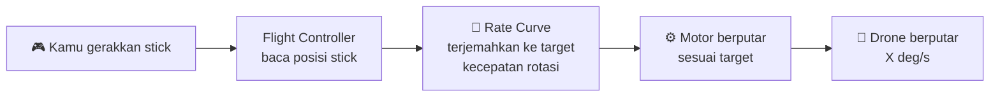
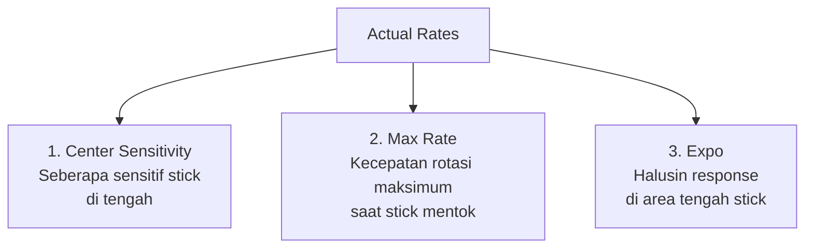
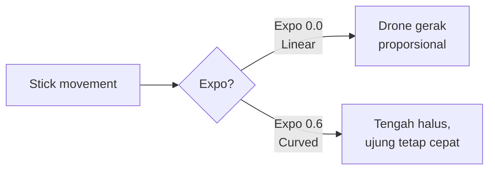
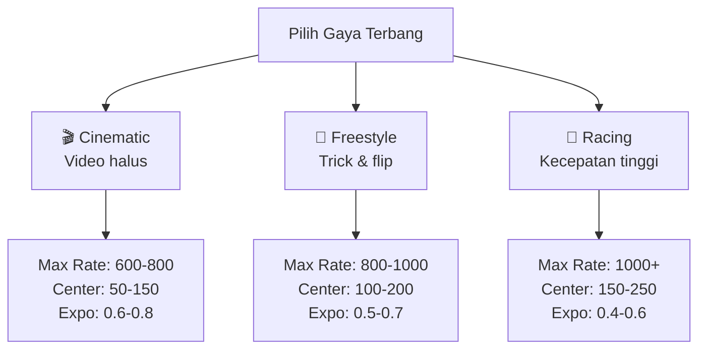
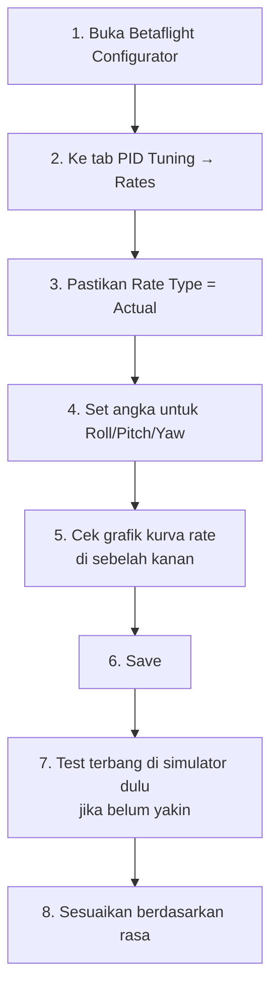
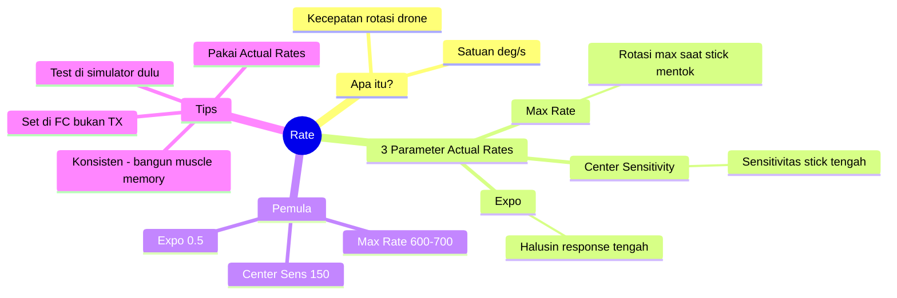

# Memahami Betaflight Rate untuk Pemula

> Panduan **super sederhana** untuk memahami apa itu **Rate** di Betaflight.
> Cocok untuk pemula yang baru terjun ke dunia FPV drone.
>
> **Referensi terpercaya:**
> - Oscar Liang — <https://oscarliang.com/rates/>
> - Betaflight Rate Calculator — <https://betaflight.com/docs/wiki/guides/current/Rate-Calculator>
> - Dokumentasi resmi Betaflight — <https://betaflight.com>

---

## Daftar Isi

1. [Apa Itu Rate?](#1-apa-itu-rate)
2. [Analogi Sederhana](#2-analogi-sederhana)
3. [3 Parameter Penting di Actual Rates](#3-3-parameter-penting-di-actual-rates)
4. [Contoh Konkret: Stick vs Drone](#4-contoh-konkret-stick-vs-drone)
5. [Rate Berdasarkan Gaya Terbang](#5-rate-berdasarkan-gaya-terbang)
6. [Cara Setting Rate Pertama Kali](#6-cara-setting-rate-pertama-kali)
7. [Kesalahan Umum Pemula](#7-kesalahan-umum-pemula)
8. [Tools Bantu](#8-tools-bantu)
9. [Ringkasan](#9-ringkasan)

---

## 1. Apa Itu Rate?

**Rate** = seberapa **cepat drone berputar** ketika kamu menggerakkan stick di radio.

Diukur dalam **derajat per detik** (deg/s atau °/s).

> Contoh: Rate **800 deg/s** artinya drone bisa berputar **800 derajat dalam 1 detik** (sekitar 2 putaran penuh per detik) saat stick digerakkan **maksimal**.



**Kuncinya:** Rate **bukan** soal cepat/lambat drone terbang ke depan. Rate hanya tentang **seberapa cepat drone berputar** (roll, pitch, yaw).

---

## 2. Analogi Sederhana

Bayangkan kamu mengendarai mobil dengan setir:

| Pengaturan | Analogi Mobil |
|---|---|
| **Rate rendah** | Setir mobil truk besar — putar penuh = belok pelan |
| **Rate tinggi** | Setir mobil F1 — sentuh sedikit langsung belok tajam |

> 🍼 **Untuk pemula:** Rate **rendah** itu lebih aman & mudah dikendalikan, mirip belajar nyetir mobil truk dulu sebelum F1.

---

## 3. 3 Parameter Penting di Actual Rates

Betaflight punya banyak sistem rate, tapi yang **paling direkomendasikan** untuk pemula adalah **Actual Rates** (paling intuitif).

Actual Rates hanya punya **3 angka** yang perlu kamu pahami:



### 3.1 Center Sensitivity

**Fungsi:** Mengatur seberapa **sensitif drone di sekitar stick tengah**.

| Value | Efek |
|---|---|
| Rendah (50–150) | Halus, gerakan kecil terasa lembut |
| Tinggi (200–300) | Reaktif, sentuhan kecil = drone langsung gerak |

**Analogi:** Ini seperti "deadzone" mouse gaming. Mouse sensitivity rendah = harus geser jauh untuk pindah kursor; tinggi = sentuh sedikit langsung melesat.

### 3.2 Max Rate

**Fungsi:** Menentukan **kecepatan rotasi maksimum** saat stick **mentok 100%**.

| Value | Efek |
|---|---|
| 600 deg/s | Pelan, halus (cocok video sinematik) |
| 1000 deg/s | Cepat, snappy (cocok freestyle) |
| 1500 deg/s | Sangat cepat (racer/LOS profesional) |

**Contoh nyata:**
- Max Rate **720 deg/s** → drone butuh **0.5 detik** untuk berputar 360° (1x flip).
- Max Rate **1440 deg/s** → drone butuh **0.25 detik** untuk berputar 360° (super cepat!).

### 3.3 Expo

**Fungsi:** Menghaluskan response di **bagian tengah stick** (tidak mempengaruhi maksimum).

| Value | Efek |
|---|---|
| 0.0 | Linear murni — gerakan stick = gerakan drone proporsional |
| 0.5 | Tengah lebih halus, ujung tetap snappy |
| 0.8 | Tengah sangat halus (cinematic), ujung agak "meledak" |



---

## 4. Contoh Konkret: Stick vs Drone

Misalkan kamu set:
- Center Sensitivity = **150**
- Max Rate = **800** deg/s
- Expo = **0.5**

| Posisi Stick | Drone Berputar |
|---|---|
| Stick 0% (tengah) | 0 deg/s (diam) |
| Stick 25% | ~80 deg/s (pelan) |
| Stick 50% | ~250 deg/s (sedang) |
| Stick 75% | ~500 deg/s (cepat) |
| Stick 100% (mentok) | 800 deg/s (maksimum) |

> 💡 Karena ada **Expo 0.5**, kenaikan tidak linear — stick 25–50% akan terasa **lebih halus** dibanding stick 50–100%.

---

## 5. Rate Berdasarkan Gaya Terbang



### Rekomendasi untuk Pemula

| Setting | Nilai Aman |
|---|---|
| Center Sensitivity | **150** |
| Max Rate | **700** |
| Expo | **0.5** |

> 🍼 Mulai dari sini, lalu naikkan **Max Rate** secara bertahap (50–100 deg/s setiap kali) seiring kemampuan terbang meningkat.

---

## 6. Cara Setting Rate Pertama Kali

### Langkah-langkah:



### Tips:

1. **Pitch & Roll boleh sama**, atau set Roll lebih tinggi 100–200 deg/s untuk freestyle.
2. **Yaw** biasanya lebih rendah dari Pitch/Roll (mis. 600 deg/s) karena yaw secara fisika memang lebih lambat.
3. **Test di simulator** dulu (Liftoff, Velocidrone, DRL) sebelum terbang sungguhan.

### Rate Pemula yang Direkomendasikan (Copy-Paste):

```
Roll/Pitch:
  Center Sensitivity: 150
  Max Rate: 700
  Expo: 0.50

Yaw:
  Center Sensitivity: 150
  Max Rate: 600
  Expo: 0.50
```

---

## 7. Kesalahan Umum Pemula

| Kesalahan | Akibat | Solusi |
|---|---|---|
| **Rate terlalu tinggi sejak awal** | Drone twitchy, susah dikontrol, sering crash | Mulai dari Max Rate 600–700 dulu |
| **Set Expo di radio (TX)** | Mengurangi resolusi stick | Set Expo **di Betaflight saja**, biarkan TX linear |
| **Sering ganti rate** | Muscle memory tidak terbentuk | Pilih satu rate, pakai konsisten 1–2 bulan |
| **Ikut rate pilot pro mentah-mentah** | Pilot pro pakai rate ekstrem (1500+) | Sesuaikan dengan kemampuanmu |
| **Mengira Rate = kecepatan terbang** | Bingung kenapa drone tetap pelan walau Rate tinggi | Rate hanya rotasi; kecepatan terbang dari throttle/sudut pitch |

---

## 8. Tools Bantu

### 8.1 Betaflight Rate Calculator (Resmi)
- URL: <https://betaflight.com/docs/wiki/guides/current/Rate-Calculator>
- Fungsi: Hitung & visualisasikan kurva rate sebelum terbang.

### 8.2 Metamarc Rate Visualizer
- URL: <https://rates.metamarc.com/>
- Fungsi: Bandingkan rate kamu dengan rate pilot terkenal (Bardwell, MrSteele, dll).

### 8.3 Simulator FPV
- **Liftoff**, **Velocidrone**, **DRL Simulator**, **TRYP FPV** (gratis).
- Test rate baru di simulator sebelum apply ke drone asli.

---

## 9. Ringkasan



**3 hal yang harus diingat:**

1. **Rate ≠ kecepatan terbang.** Rate adalah seberapa cepat drone **berputar**, bukan seberapa cepat ia melaju.
2. **Pakai Actual Rates** — paling mudah dipahami pemula.
3. **Mulai pelan, naikkan bertahap.** Konsistensi > perfeksi.

> 🚁 Selamat mencoba! Ingat: **drone yang kamu kuasai > drone dengan rate paling extreme**. Latihan terbang lebih penting daripada angka di Configurator.

---

## Bacaan Lanjut

- 📘 [Panduan Lengkap Tuning Betaflight (Bahasa Indonesia)](PANDUAN_TUNING_BETAFLIGHT.md) — sudah include tuning rate detail
- 📘 [Memahami PID untuk Pemula](MEMAHAMI_PID.md) — pasangan Rate, wajib dipahami juga!
