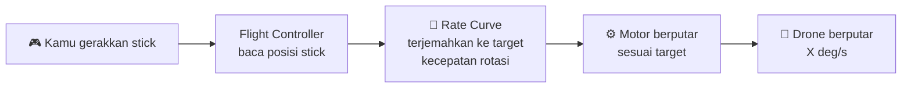
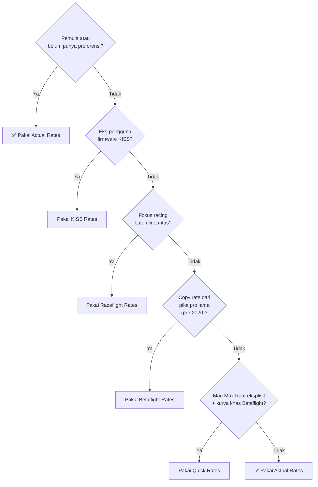
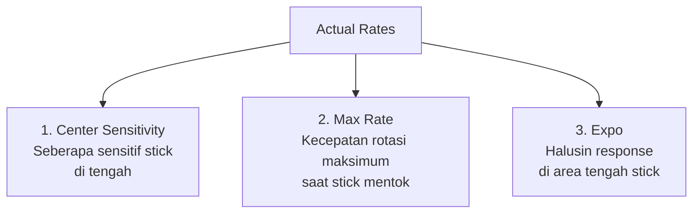
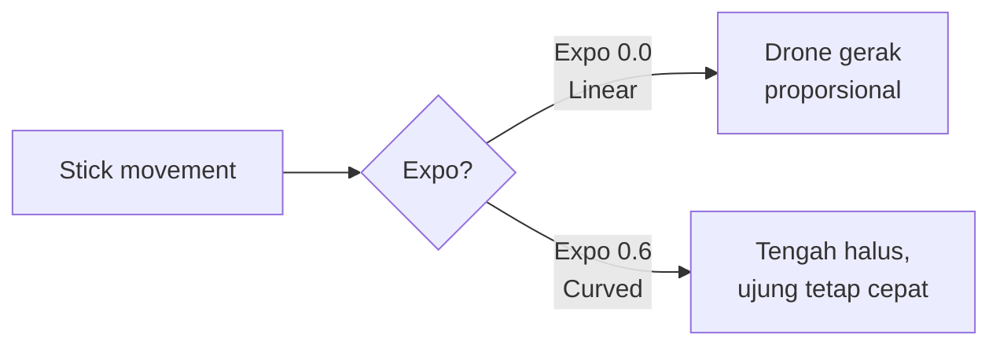
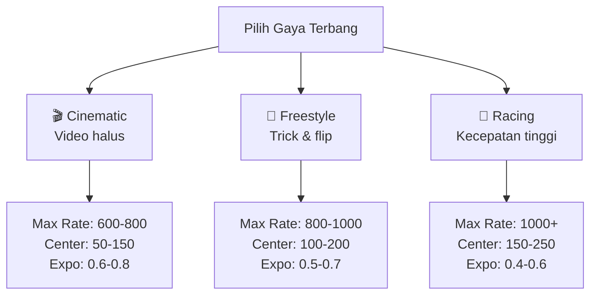
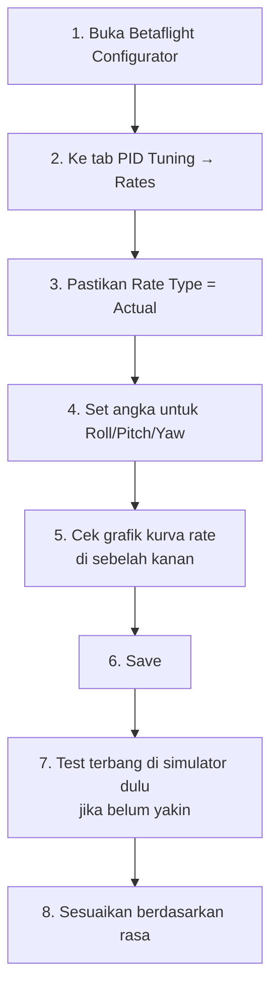
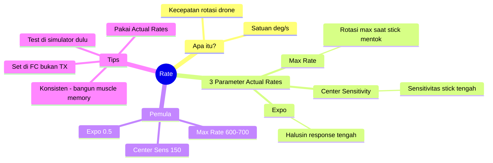

# Memahami Betaflight Rate untuk Pemula

> 📺 **Dibuat oleh [SkyfluxFPV](https://www.instagram.com/skyfluxfpv/)** · [Instagram](https://www.instagram.com/skyfluxfpv/) · [TikTok](https://www.tiktok.com/@skyfluxfpv)
>
> Panduan **super sederhana** untuk memahami apa itu **Rate** di Betaflight.
> Cocok untuk pemula yang baru terjun ke dunia FPV drone.
>
> **Referensi terpercaya:**
> - Oscar Liang — <https://oscarliang.com/rates/>
> - Betaflight Rate Calculator — <https://betaflight.com/docs/wiki/guides/current/Rate-Calculator>
> - Dokumentasi resmi Betaflight — <https://betaflight.com>

---

## Daftar Isi

1. [Apa Itu Rate?](#1-apa-itu-rate)
2. [Analogi Sederhana](#2-analogi-sederhana)
3. [Sistem Rate di Betaflight (Pilihan & Perbandingan)](#3-sistem-rate-di-betaflight-pilihan--perbandingan)
4. [3 Parameter Penting di Actual Rates](#4-3-parameter-penting-di-actual-rates)
5. [Parameter Tambahan: Throttle & Yaw](#5-parameter-tambahan-throttle--yaw)
6. [Contoh Konkret: Stick vs Drone](#6-contoh-konkret-stick-vs-drone)
7. [Rate Berdasarkan Gaya Terbang](#7-rate-berdasarkan-gaya-terbang)
8. [Cara Setting Rate Pertama Kali](#8-cara-setting-rate-pertama-kali)
9. [Kesalahan Umum Pemula](#9-kesalahan-umum-pemula)
10. [Tools Bantu](#10-tools-bantu)
11. [Ringkasan](#11-ringkasan)

---

## 1. Apa Itu Rate?

**Rate** = seberapa **cepat drone berputar** ketika kamu menggerakkan stick di radio.

Diukur dalam **derajat per detik** (deg/s atau °/s).

> Contoh: Rate **800 deg/s** artinya drone bisa berputar **800 derajat dalam 1 detik** (sekitar 2 putaran penuh per detik) saat stick digerakkan **maksimal**.



**Kuncinya:** Rate **bukan** soal cepat/lambat drone terbang ke depan. Rate hanya tentang **seberapa cepat drone berputar** (roll, pitch, yaw).

---

## 2. Analogi Sederhana

Bayangkan kamu mengendarai mobil dengan setir:

| Pengaturan | Analogi Mobil |
|---|---|
| **Rate rendah** | Setir mobil truk besar — putar penuh = belok pelan |
| **Rate tinggi** | Setir mobil F1 — sentuh sedikit langsung belok tajam |

> 🍼 **Untuk pemula:** Rate **rendah** itu lebih aman & mudah dikendalikan, mirip belajar nyetir mobil truk dulu sebelum F1.

---

## 3. Sistem Rate di Betaflight (Pilihan & Perbandingan)

Betaflight tidak hanya punya **satu** sistem rate — ada **5 jenis** yang bisa kamu pilih di **PID Tuning → Rates → Rates type**. Semua menghasilkan kurva stick → kecepatan rotasi, tapi cara menghitung & "rasa"-nya berbeda.

> 📚 **Sumber:** [Betaflight Wiki — Rates](https://betaflight.com/docs/wiki/configurator/rates-tab) · [Oscar Liang — Betaflight Rates Explained](https://oscarliang.com/rates/) · [Joshua Bardwell — Rates Explained](https://www.youtube.com/c/JoshuaBardwell)

### 3.1 Tabel Perbandingan Singkat

| Sistem | Parameter Utama | Cocok Untuk | Tingkat Kesulitan |
|---|---|---|---|
| **Betaflight** (legacy) | RC Rate, Super Rate, RC Expo | Pengguna lama yang sudah hafal | ⭐⭐⭐ Susah dipahami |
| **Raceflight** | Rate, Acro+, Expo | Pilot racing yang ingin linearitas | ⭐⭐ Cukup mudah |
| **KISS** | RC Rate, Rate, RC Curve | Pengguna eks-firmware KISS | ⭐⭐ Cukup mudah |
| **Actual** ⭐ (default modern) | Center Sensitivity, Max Rate, Expo | **Pemula & semua orang** | ⭐ Paling mudah |
| **Quick Rates** | RC Rate, Max Rate, Expo | Pengguna ingin angka pasti + kurva khas BF | ⭐⭐ Mudah |

> 💡 **TL;DR untuk pemula:** Pakai **Actual Rates**. Itu saja. Sistem lain hanya untuk pengguna lama atau kebutuhan khusus.

### 3.2 Penjelasan Detail Tiap Sistem

#### 🔹 Betaflight Rates (legacy / default lama)

Sistem **paling tua** dan dulu jadi default. Punya 3 parameter:
- **RC Rate** (0.01–2.55) — sensitivitas dasar di sekitar tengah stick.
- **Super Rate** (0.00–0.99) — menambah kecepatan ekstra di ujung stick (curve eksponensial).
- **RC Expo** (0.00–1.00) — halusin tengah stick.

**Kelebihan:**
- ✅ Banyak panduan lama & rate file pro pilot menggunakan sistem ini.
- ✅ Fleksibel untuk membuat kurva non-linear yang ekstrem.

**Kekurangan:**
- ❌ **Sulit memprediksi Max Rate** — harus dihitung manual atau pakai kalkulator.
- ❌ Interaksi 3 parameter saling pengaruh, bingung untuk pemula.
- ❌ Rate maksimum tidak langsung terlihat dari angka — harus lihat grafik.

**Kapan dipakai:** Kalau kamu meng-copy rate dari pilot terkenal (Mr. Steele, Bardwell era 2018) yang masih pakai sistem ini.

#### 🔹 Raceflight Rates

Diadopsi dari firmware **Raceflight**. Menonjol karena **linearitas** (kurva lurus = response prediktabel).

- **Rate** (deg/s) — langsung Max Rate.
- **Acro+** — menambah ekstra kecepatan di ujung stick (mirip Super Rate tapi lebih halus).
- **Expo** — halusin tengah.

**Kelebihan:**
- ✅ Max Rate **langsung dalam deg/s** — gampang dipahami.
- ✅ Sangat **linear** → response konsisten dari stick rendah ke tinggi.
- ✅ Cocok untuk **racing** karena prediktabel.

**Kekurangan:**
- ❌ Kurang populer, komunitas lebih kecil.
- ❌ Kurang "snappy" di ujung dibanding Betaflight Rates.

**Kapan dipakai:** Pilot **racing** yang butuh response super konsisten.

#### 🔹 KISS Rates

Dari firmware **KISS FC**. Mirip Betaflight Rates tapi dengan kurva sedikit berbeda.

- **RC Rate** — sensitivitas dasar.
- **Rate** — Super-rate-like (menambah ujung).
- **RC Curve** — expo / pelembutan.

**Kelebihan:**
- ✅ Rasa khas KISS (smooth & prediktabel).
- ✅ Cocok untuk pengguna pindahan dari KISS firmware.

**Kekurangan:**
- ❌ Komunitas Betaflight kecil yang pakai ini.
- ❌ Tidak ada keuntungan jelas dibanding Actual untuk pemula.

**Kapan dipakai:** Hanya kalau kamu **eks-pengguna KISS firmware** dan ingin rasa yang familiar.

#### 🔹 Actual Rates ⭐ (REKOMENDASI)

Diperkenalkan di **Betaflight 4.x** sebagai default modern. Dirancang agar **paling mudah dipahami manusia**.

- **Center Sensitivity** (deg/s) — kecepatan rotasi saat stick di ~50% dari tengah.
- **Max Rate** (deg/s) — kecepatan rotasi MAKSIMUM saat stick mentok.
- **Expo** (0–1) — halusin tengah stick.

**Kelebihan:**
- ✅ **Paling intuitif** — tiap angka punya arti fisik nyata (deg/s).
- ✅ Max Rate **persis** seperti yang kamu set (tidak perlu kalkulator).
- ✅ **Center Sensitivity terpisah** dari Max Rate — bisa atur "rasa stick tengah" tanpa mempengaruhi maksimum.
- ✅ Direkomendasikan resmi oleh Betaflight & Joshua Bardwell.

**Kekurangan:**
- ⚠️ Kurva di area tengah agak berbeda dari Betaflight Rates lama (perlu adaptasi sebentar untuk yang sudah biasa).

**Kapan dipakai:** **SELALU** — kecuali ada alasan khusus. Ini default modern Betaflight.

#### 🔹 Quick Rates

Juga ditambahkan di era **Betaflight 4.x**. Hybrid antara Betaflight Rates & Actual.

- **RC Rate** — sensitivitas dasar (mirip Betaflight).
- **Max Rate** (deg/s) — Max Rate eksplisit (mirip Actual).
- **Expo** — halusin tengah.

**Kelebihan:**
- ✅ Max Rate eksplisit dalam deg/s seperti Actual.
- ✅ Kurva tengah mirip Betaflight Rates klasik (familiar bagi pengguna lama).

**Kekurangan:**
- ❌ Ada 2 parameter yang saling pengaruh untuk area tengah (RC Rate + Expo) → kurang clean dibanding Actual.

**Kapan dipakai:** Pengguna lama yang ingin **angka Max Rate eksplisit** tapi tetap suka kurva khas Betaflight Rates.

### 3.3 Pohon Keputusan: Pilih Sistem Mana?



### 3.4 Konversi Antar Sistem

Kalau kamu menemukan rate file dalam sistem berbeda dan ingin konversi ke **Actual Rates**:

1. Buka **Betaflight Rate Calculator**: <https://betaflight.com/docs/wiki/guides/current/Rate-Calculator>
2. Masukkan nilai rate **lama** (di sistem aslinya).
3. Lihat **Max Rate (deg/s)** & **Center Sensitivity** yang dihasilkan grafik.
4. Salin nilai itu ke **Actual Rates**.

> ⚠️ **Penting:** Jangan asal copy angka antar sistem. RC Rate 1.0 di Betaflight Rates ≠ Center Sensitivity 100 di Actual Rates. **Selalu konversi via grafik / kalkulator.**

---

## 4. 3 Parameter Penting di Actual Rates

Betaflight punya banyak sistem rate, tapi yang **paling direkomendasikan** untuk pemula adalah **Actual Rates** (paling intuitif).

Actual Rates hanya punya **3 angka** yang perlu kamu pahami:



### 4.1 Center Sensitivity

**Fungsi:** Mengatur seberapa **sensitif drone di sekitar stick tengah**.

| Value | Efek |
|---|---|
| Rendah (50–150) | Halus, gerakan kecil terasa lembut |
| Tinggi (200–300) | Reaktif, sentuhan kecil = drone langsung gerak |

**Analogi:** Ini seperti "deadzone" mouse gaming. Mouse sensitivity rendah = harus geser jauh untuk pindah kursor; tinggi = sentuh sedikit langsung melesat.

### 4.2 Max Rate

**Fungsi:** Menentukan **kecepatan rotasi maksimum** saat stick **mentok 100%**.

| Value | Efek |
|---|---|
| 600 deg/s | Pelan, halus (cocok video sinematik) |
| 1000 deg/s | Cepat, snappy (cocok freestyle) |
| 1500 deg/s | Sangat cepat (racer/LOS profesional) |

**Contoh nyata:**
- Max Rate **720 deg/s** → drone butuh **0.5 detik** untuk berputar 360° (1x flip).
- Max Rate **1440 deg/s** → drone butuh **0.25 detik** untuk berputar 360° (super cepat!).

### 4.3 Expo

**Fungsi:** Menghaluskan response di **bagian tengah stick** (tidak mempengaruhi maksimum).

| Value | Efek |
|---|---|
| 0.0 | Linear murni — gerakan stick = gerakan drone proporsional |
| 0.5 | Tengah lebih halus, ujung tetap snappy |
| 0.8 | Tengah sangat halus (cinematic), ujung agak "meledak" |



---

## 5. Parameter Tambahan: Throttle & Yaw

Selain Center Sensitivity / Max Rate / Expo, ada beberapa parameter lain di tab **Rates** Betaflight Configurator yang sering bikin pemula bingung. Berikut yang **wajib tahu**:

> 📚 **Sumber:** [Oscar Liang — Throttle Mid & Expo](https://oscarliang.com/rates/#Throttle-Mid-and-Throttle-Expo) · [Betaflight Wiki — Rates Tab](https://betaflight.com/docs/wiki/configurator/rates-tab)

### 5.1 Throttle Mid

**Fungsi:** Menggeser **titik tengah** kurva throttle (untuk Throttle Expo).

- **Nilai:** 0.0 – 1.0 (default **0.50**).
- **Default 0.5** → kurva expo simetris di tengah stick throttle.
- **Naikkan ke 0.6–0.8** → "stretch" area sensitif ke throttle yang lebih tinggi (cocok kalau cruising di throttle tinggi).
- **Turunkan ke 0.2–0.3** → cocok untuk **tiny whoop / cinewhoop** yang hover di throttle rendah.

> 💡 Throttle Mid **tidak berefek apa-apa** kalau Throttle Expo = 0. Selalu set bareng.

### 5.2 Throttle Expo

**Fungsi:** Menghaluskan kurva throttle di sekitar **Throttle Mid**.

- **Nilai:** 0.0 – 1.0 (default **0.0**).
- **0.0** → throttle linear, paling responsif.
- **0.3–0.5** → halus untuk hover/cruising — bagus untuk **cinematic & whoop**.
- **0.6–0.8** → sangat halus, banyak pemula whoop pakai ini agar drone lebih mudah hover.

> 🍼 **Untuk pemula 5" freestyle:** biarkan default (0.0). Untuk **whoop/cinewhoop**, set Throttle Mid ~0.3 + Throttle Expo ~0.5–0.6 supaya gampang hover.

### 5.3 Throttle Limit (Type & Percent)

**Fungsi:** Membatasi **throttle maksimum** dari stick — berguna untuk drone overpowered atau battery drop.

- **Throttle Limit Type:**
  - `OFF` — tidak ada limit (default).
  - `SCALE` — kurva throttle di-skala ulang (range stick penuh tapi maksimum lebih rendah).
  - `CLIP` — throttle dipotong di nilai maksimum (stick di atas threshold tetap = nilai maksimum).
- **Throttle Limit Percent:** 25–100% (default 100%).

**Contoh penggunaan:**
- Drone 5" overpowered untuk **cinematic** → set `SCALE` 80% agar throttle lebih halus.
- Drone racing yang **ingin proteksi battery sag** → set `CLIP` 90%.

### 5.4 Rekomendasi Yaw vs Roll/Pitch

Banyak pemula bingung apakah **Yaw** harus sama dengan Roll/Pitch. Praktik umum:

| Axis | Karakteristik | Rekomendasi |
|---|---|---|
| **Roll** | Putaran samping (sumbu depan-belakang) | Max Rate sama atau **sedikit lebih tinggi** dari Pitch (untuk roll snappy) |
| **Pitch** | Putaran depan-belakang (sumbu kiri-kanan) | Baseline — set sama dengan Roll |
| **Yaw** | Putaran sumbu vertikal | Max Rate **lebih rendah** (50–80% dari Roll) — yaw secara fisika memang lebih lambat karena drag prop |

**Contoh praktis:**

| Style | Roll/Pitch Max Rate | Yaw Max Rate |
|---|---|---|
| Pemula | 700 | 600 |
| Freestyle | 1000 | 700 |
| Racing | 1200 | 800 |

> 💡 **Joshua Bardwell** sering pakai Roll & Pitch sama, dengan Yaw sekitar 70% dari nilai Roll/Pitch. **Oscar Liang** pakai Yaw ~650 untuk freestyle saat Roll/Pitch 1000.

### 5.5 Tabel Ringkasan Semua Parameter Rate

| Parameter | Range | Default 5" | Pengaruh |
|---|---|---|---|
| Center Sensitivity | 1–500 deg/s | 150–200 | Sensitivitas stick di tengah |
| Max Rate | 1–2000 deg/s | 700–1000 | Kecepatan rotasi maksimum |
| Expo | 0.00–1.00 | 0.50 | Halusin tengah stick |
| Throttle Mid | 0.00–1.00 | 0.50 | Titik tengah kurva throttle |
| Throttle Expo | 0.00–1.00 | 0.00 | Halusin throttle di sekitar Mid |
| Throttle Limit Type | OFF/SCALE/CLIP | OFF | Cara membatasi throttle max |
| Throttle Limit % | 25–100% | 100% | Persentase batas throttle |

---

## 6. Contoh Konkret: Stick vs Drone

Misalkan kamu set:
- Center Sensitivity = **150**
- Max Rate = **800** deg/s
- Expo = **0.5**

| Posisi Stick | Drone Berputar |
|---|---|
| Stick 0% (tengah) | 0 deg/s (diam) |
| Stick 25% | ~80 deg/s (pelan) |
| Stick 50% | ~250 deg/s (sedang) |
| Stick 75% | ~500 deg/s (cepat) |
| Stick 100% (mentok) | 800 deg/s (maksimum) |

> 💡 Karena ada **Expo 0.5**, kenaikan tidak linear — stick 25–50% akan terasa **lebih halus** dibanding stick 50–100%.

---

## 7. Rate Berdasarkan Gaya Terbang



### Rekomendasi untuk Pemula

| Setting | Nilai Aman |
|---|---|
| Center Sensitivity | **150** |
| Max Rate | **700** |
| Expo | **0.5** |

> 🍼 Mulai dari sini, lalu naikkan **Max Rate** secara bertahap (50–100 deg/s setiap kali) seiring kemampuan terbang meningkat.

---

## 8. Cara Setting Rate Pertama Kali

### Langkah-langkah:



### Tips:

1. **Pitch & Roll boleh sama**, atau set Roll lebih tinggi 100–200 deg/s untuk freestyle.
2. **Yaw** biasanya lebih rendah dari Pitch/Roll (mis. 600 deg/s) karena yaw secara fisika memang lebih lambat.
3. **Test di simulator** dulu (Liftoff, Velocidrone, DRL) sebelum terbang sungguhan.

### Rate Pemula yang Direkomendasikan (Copy-Paste):

```
Roll/Pitch:
  Center Sensitivity: 150
  Max Rate: 700
  Expo: 0.50

Yaw:
  Center Sensitivity: 150
  Max Rate: 600
  Expo: 0.50
```

---

## 9. Kesalahan Umum Pemula

| Kesalahan | Akibat | Solusi |
|---|---|---|
| **Rate terlalu tinggi sejak awal** | Drone twitchy, susah dikontrol, sering crash | Mulai dari Max Rate 600–700 dulu |
| **Set Expo di radio (TX)** | Mengurangi resolusi stick | Set Expo **di Betaflight saja**, biarkan TX linear |
| **Sering ganti rate** | Muscle memory tidak terbentuk | Pilih satu rate, pakai konsisten 1–2 bulan |
| **Ikut rate pilot pro mentah-mentah** | Pilot pro pakai rate ekstrem (1500+) | Sesuaikan dengan kemampuanmu |
| **Mengira Rate = kecepatan terbang** | Bingung kenapa drone tetap pelan walau Rate tinggi | Rate hanya rotasi; kecepatan terbang dari throttle/sudut pitch |

---

## 10. Tools Bantu

### 10.1 Betaflight Rate Calculator (Resmi)
- URL: <https://betaflight.com/docs/wiki/guides/current/Rate-Calculator>
- Fungsi: Hitung & visualisasikan kurva rate sebelum terbang.

### 10.2 Metamarc Rate Visualizer
- URL: <https://rates.metamarc.com/>
- Fungsi: Bandingkan rate kamu dengan rate pilot terkenal (Bardwell, MrSteele, dll).

### 10.3 Simulator FPV
- **Liftoff**, **Velocidrone**, **DRL Simulator**, **TRYP FPV** (gratis).
- Test rate baru di simulator sebelum apply ke drone asli.

---

## 11. Ringkasan



**3 hal yang harus diingat:**

1. **Rate ≠ kecepatan terbang.** Rate adalah seberapa cepat drone **berputar**, bukan seberapa cepat ia melaju.
2. **Pakai Actual Rates** — paling mudah dipahami pemula.
3. **Mulai pelan, naikkan bertahap.** Konsistensi > perfeksi.

> 🚁 Selamat mencoba! Ingat: **drone yang kamu kuasai > drone dengan rate paling extreme**. Latihan terbang lebih penting daripada angka di Configurator.

---

## Bacaan Lanjut

- 📘 [Panduan Lengkap Tuning Betaflight (Bahasa Indonesia)](PANDUAN_TUNING_BETAFLIGHT.md) — sudah include tuning rate detail
- 📘 [Memahami PID untuk Pemula](MEMAHAMI_PID.md) — pasangan Rate, wajib dipahami juga!

---

<p align="center">
  📺 Dibuat oleh <strong>SkyfluxFPV</strong> · <a href="https://www.instagram.com/skyfluxfpv/">Instagram</a> · <a href="https://www.tiktok.com/@skyfluxfpv">TikTok</a><br/>
  <em>Follow untuk konten FPV</em>
</p>
