# Panduan Tuning Betaflight untuk FPV Drone

> 📺 **Dibuat oleh [SkyfluxFPV](https://www.instagram.com/skyfluxfpv/)** · [Instagram](https://www.instagram.com/skyfluxfpv/) · [TikTok](https://www.tiktok.com/@skyfluxfpv)
>
> Panduan komprehensif untuk pemula hingga menengah. Berisi penjelasan parameter, langkah-langkah tuning **Rate** dan **PID**, serta tips filter dan troubleshooting.
>
> Referensi utama:
> - Dokumentasi resmi Betaflight — <https://betaflight.com>
> - Betaflight 4.5 Release Notes — <https://github.com/betaflight/betaflight/releases/tag/4.5.0>
> - Betaflight Rate Calculator — <https://betaflight.com/docs/wiki/guides/current/Rate-Calculator>
> - Oscar Liang — Rates: <https://oscarliang.com/rates/>
> - Oscar Liang — Blackbox & PID Tuning (Edisi Juni 2024, BF 4.5): <https://oscarliang.com/pid-filter-tuning-blackbox/>
> - Joshua Bardwell, Chris Rosser (YouTube) — referensi komunitas
>
> ✅ **Status validasi (terakhir di-cross-check):** Nilai default & rekomendasi parameter di panduan ini sudah dicocokkan dengan Oscar Liang (PID/Filter/Blackbox guide edisi Juni 2024 untuk Betaflight 4.5) dan release notes Betaflight 4.5.0. Lihat [Lampiran A: Ringkasan Validasi](#lampiran-a-ringkasan-validasi-vs-sumber-resmi) di akhir dokumen.
>
> ⚠️ **Disclaimer**: Tuning drone berisiko. Selalu lepas propeler saat mengubah konfigurasi di meja, terbang di area aman, dan backup dump CLI sebelum mengubah pengaturan.

---

## Daftar Isi

1. [Pendahuluan: Apa Itu Tuning?](#1-pendahuluan-apa-itu-tuning)
2. [Persiapan Sebelum Tuning](#2-persiapan-sebelum-tuning)
3. [Konsep Dasar: PID, Rate, Filter, Feedforward](#3-konsep-dasar)
4. [Penjelasan Parameter Bahasa Pemula](#4-penjelasan-parameter)
5. [Alur Proses Tuning (Big Picture)](#5-alur-proses-tuning)
6. [Step-by-Step: Tuning Rate](#6-step-by-step-tuning-rate)
7. [Step-by-Step: Tuning Filter](#7-step-by-step-tuning-filter)
8. [Step-by-Step: Tuning PID](#8-step-by-step-tuning-pid)
9. [Pengaturan Lanjutan (Anti-Gravity, TPA, Dyn Idle, dll)](#9-pengaturan-lanjutan)
10. [Troubleshooting Umum](#10-troubleshooting-umum)
11. [Checklist Akhir & Tips Pro](#11-checklist-akhir--tips-pro)
12. [Analisa Blackbox — Panduan Lengkap](#12-analisa-blackbox--panduan-lengkap)
13. [Glosarium](#13-glosarium)

---

## 1. Pendahuluan: Apa Itu Tuning?

**Tuning** adalah proses menyesuaikan parameter di firmware **Betaflight** agar drone Anda terbang **stabil, responsif, dan halus** sesuai gaya terbang (freestyle, racing, cinematic, dll).

Tuning yang baik akan:
- Menghilangkan **getaran (oscillation)** dan **propwash**.
- Menjaga **motor tidak panas berlebihan**.
- Membuat respons stick terasa **alami dan presisi**.
- Memaksimalkan performa hardware (motor, ESC, propeler).

> **Pemula wajib paham:** Tuning bukan sihir. Drone dengan hardware bermasalah (frame retak, propeler bengkok, sekrup longgar) **tidak bisa diselamatkan oleh tuning**. Selalu mulai dari build yang sehat.

---

## 2. Persiapan Sebelum Tuning

### 2.1 Hardware Wajib Dicek

| Item | Catatan |
|---|---|
| Frame & sekrup FC | Gunakan grommet karet (soft mount), sekrup metal, kencangkan tapi jangan over-tight |
| Propeler | Baru, balanced, tidak bengkok/retak |
| Motor | Bearing halus, tidak ada drag |
| Kapasitor | Pasang kapasitor low-ESR (≥ 1000µF) di power input ESC |
| ESC | BLHeli_32 atau Bluejay (BLHeli_S) untuk **bi-directional DShot** |
| Gyro | Mounting bersih, jauh dari kabel power |

### 2.2 Software & Konfigurasi Awal

1. **Update firmware Betaflight** ke versi stabil terbaru (≥ 4.5).
2. **Aktifkan Expert Mode** di Betaflight Configurator.
3. Di tab **Configuration**:
   - PID Loop Frequency: **8 kHz** (gyro 8K) untuk FC modern, atau **4 kHz** untuk BMI270.
4. Di tab **Motor**:
   - ESC Protocol: **DShot600** (8K) atau **DShot300** (4K).
   - Aktifkan **Bi-directional DShot** (penting untuk RPM filter).
5. Di tab **Receiver**:
   - Load **RC Link Preset** sesuai radio Anda (ELRS / Crossfire / dll).
6. Di radio (EdgeTX/OpenTX):
   - **Matikan ADC Filter** (System → Hardware) untuk mengurangi latency.
7. Di tab **Blackbox** (jika tuning lanjut):
   - Logging Device: **Onboard Flash** atau **SD Card**.
   - Logging Rate: **2 kHz** (atau 1.6 kHz untuk BMI270).
   - Debug Mode: **GYRO_SCALED**.

### 2.3 Backup Konfigurasi

Buka tab **CLI**, ketik:

```
diff all
```

Copy semua hasil ke notepad/file `.txt`. Ini adalah **backup** Anda — bisa di-paste kembali jika tuning gagal.

---

## 3. Konsep Dasar

### 3.1 Apa Itu PID?

**PID = Proportional, Integral, Derivative** — algoritma kontrol yang menjaga drone tetap stabil.

Bayangkan Anda mengendarai mobil dan ingin tetap di tengah jalur:

| Term | Analogi | Fungsi di Drone |
|---|---|---|
| **P** (Proportional) | Seberapa cepat Anda membelokkan setir saat keluar jalur | Kekuatan respon untuk mengoreksi error |
| **I** (Integral) | "Memori" — kalau angin terus mendorong, Anda terus melawan | Menjaga drone tetap di setpoint walau ada angin/drift |
| **D** (Derivative) | Anda memperlambat setir agar tidak overshoot | Damping, mencegah getaran/oscillation |

### 3.2 Apa Itu Rate?

**Rate** mengatur seberapa cepat drone berputar saat stick digerakkan. Diukur dalam **derajat per detik (deg/s)**.

- Rate tinggi = drone berputar cepat (cocok freestyle/racing).
- Rate rendah = drone halus (cocok cinematic).

### 3.3 Apa Itu Feedforward (FF)?

**P** hanya bereaksi setelah ada error. **Feedforward** mendahului — saat stick digerakkan, FF langsung menggerakkan motor sebelum gyro merasakan perubahan. Hasilnya: respons lebih cepat, kurang lag.

### 3.4 Apa Itu Filter?

Sinyal dari gyro mengandung **noise** (getaran motor, frame, propeler). Filter membuang noise agar PID tidak bingung dan motor tidak panas.

Trade-off: **filter banyak = noise hilang tapi delay tinggi** → drone terasa lambat. **Filter sedikit = responsif tapi motor bisa panas**.

---

## 4. Penjelasan Parameter

### 4.1 Parameter Rate (Sistem Actual Rates — Default & Direkomendasikan)

| Parameter | Penjelasan Sederhana |
|---|---|
| **Center Sensitivity** | Sensitivitas saat stick di sekitar tengah. Rendah = halus untuk koreksi kecil. Tinggi = drone reaktif. |
| **Max Rate** | Kecepatan rotasi maksimum saat stick di ujung (deg/s). Misal 800 = drone berputar 800°/detik di full stick. |
| **Expo** | Membuat respons stick di tengah lebih halus (0 = linear, 0.7 = sangat halus di tengah). |

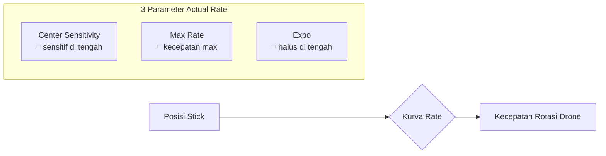

### 4.2 Parameter PID (Slider Mode di Betaflight 4.3+)

Betaflight 4.3+ menyediakan **slider** yang lebih mudah daripada tweaking angka P/I/D langsung:

| Slider | Apa yang Diatur | Efek |
|---|---|---|
| **Master Multiplier** | Mengalikan semua P/I/D | Naikkan untuk respons lebih kuat |
| **P&D Gain (Damping)** | Rasio P:D | Naikkan D = kurangi overshoot, tapi motor lebih panas |
| **P&I Gain (Drift-Wobble)** | Rasio P:I | Naikkan I = drone lebih "menempel" ke setpoint |
| **Stick Response (Feedforward)** | Kekuatan FF | Naikkan = respons stick lebih cepat |
| **D Max (Dynamic Damping)** | Boost D saat stick gerakan cepat | Mengurangi propwash |

### 4.3 Parameter Filter Penting

| Filter | Fungsi |
|---|---|
| **RPM Filter** | Filter notch dinamis berdasarkan RPM motor. **Filter terbaik di Betaflight** — wajib aktif. |
| **Dynamic Notch** | Filter notch dinamis berbasis FFT untuk frame resonance. |
| **Gyro Lowpass 1 & 2** | Membuang noise frekuensi tinggi dari sinyal gyro. |
| **D-Term Lowpass 1 & 2** | Membuang noise di jalur D-term (D sangat sensitif terhadap noise). |
| **Yaw Lowpass** | Filter khusus yaw (default 100Hz, biarkan saja). |

### 4.4 Parameter Lain yang Sering Disentuh

| Parameter | Fungsi |
|---|---|
| **Anti-Gravity** | Boost I saat throttle naik/turun cepat untuk mencegah nose-dip. |
| **Throttle Boost** | Tambahan power saat stick throttle digerakkan cepat. |
| **TPA (Throttle PID Attenuation)** | Mengurangi PID gain saat throttle tinggi (mencegah oscillation). |
| **Dynamic Idle** | Menjaga RPM motor minimum (mencegah ESC desync). |
| **Thrust Linearization** | Menyamakan respons throttle agar lebih linear. |
| **I-Term Relax** | Mencegah I-term "menumpuk" saat stick gerakan cepat. |

---

## 5. Alur Proses Tuning

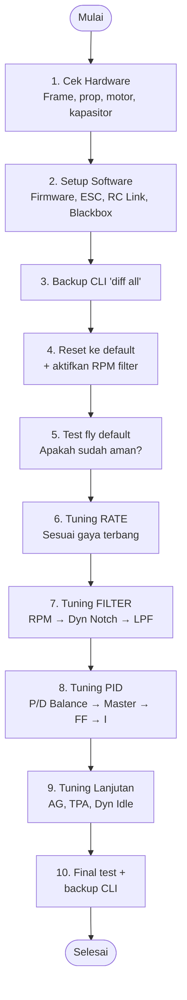

> 🎯 **Urutan WAJIB**: Filter dulu → baru PID. Karena PID gain yang aman tergantung dari seberapa bersih sinyal gyro setelah filter.

---

## 6. Step-by-Step: Tuning Rate

Rate = **selera pribadi**. Tujuan: stick terasa nyaman dan presisi sesuai gaya terbang Anda.

### 6.1 Pilih Sistem Rate

Betaflight punya 5 sistem rate. **Gunakan Actual Rates** (default, paling intuitif).

### 6.2 Starting Point Berdasarkan Gaya Terbang

| Gaya Terbang | Center Sensitivity | Max Rate | Expo |
|---|---|---|---|
| **Cinematic** (halus, smooth) | 50 – 150 | 600 – 800 | 0.6 – 0.8 |
| **Freestyle** (umum) | 100 – 200 | 800 – 1000 | 0.5 – 0.7 |
| **Racing / Line of Sight** | 150 – 250 | 1000+ | 0.4 – 0.6 |
| **Tiny Whoop** (indoor) | 200 – 300 | 900 – 1100 | 0.5 – 0.6 |

> 💡 **Tip pemula**: Mulai dari **Center Sensitivity 150, Max Rate 800, Expo 0.5** untuk roll/pitch. Yaw biasanya lebih lambat (Max Rate 600–700).

### 6.3 Langkah Tuning Rate

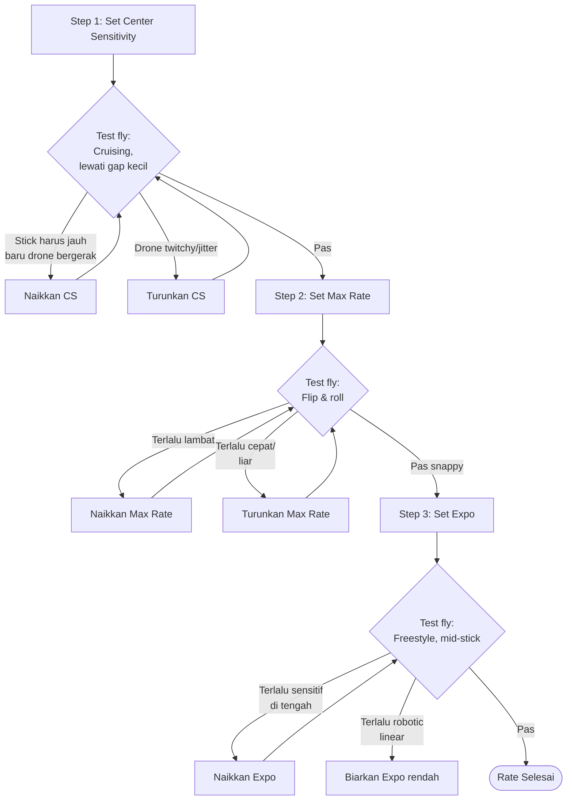

#### Detail Setiap Step:

**Step 1 — Center Sensitivity**:
1. Set Max Rate sementara di 800, Expo 0.
2. Terbang cruising (forward, belok halus, lewati gap kecil).
3. Cek **footage**: smooth-kah saat lewat gap?
   - Stick harus digerakkan **jauh** baru drone respons → **naikkan CS**.
   - Drone goyang kiri-kanan karena over-correction → **turunkan CS**.

**Step 2 — Max Rate**:
1. Lakukan **flip** dan **roll** dengan full stick.
2. Terlalu lambat? Naikkan Max Rate +100.
3. Terlalu cepat/lepas kontrol? Turunkan Max Rate −100.
4. Catat di Blackbox: "Max Vel Deg/s" sebenarnya (dibatasi power motor).

**Step 3 — Expo**:
1. Terbang freestyle dengan banyak input mid-stick.
2. Drone terasa **terlalu reaktif di tengah**? Naikkan Expo +0.05.
3. Drone terasa **terlalu linear/robotik**? Biarkan Expo rendah atau 0.
4. Expo > 0.7 bisa membuat respons di full stick **tidak predictable** — hindari berlebihan.

### 6.4 Saran Rate Yaw

Yaw biasanya **lebih lambat** dari roll/pitch karena bergantung pada inersia motor.

```
Yaw: Center Sensitivity 180-200, Max Rate 600-700, Expo 0.4-0.5
```

### 6.5 Tip Penting

> 🚨 **Jangan sering ganti rate!** Pilih satu set rate dan **stick dengan itu** — biar muscle memory terbentuk. Boleh berbeda untuk drone ukuran berbeda (5" vs Whoop), tapi konsisten untuk drone sejenis.

> 🚨 **Jangan set Expo di Radio (TX)!** Set Expo di FC saja untuk menjaga resolusi stick.

### 6.6 Rate Calculator & Visualizer Tools

Betaflight menyediakan dokumentasi resmi **Rate Calculator** untuk memahami dan membandingkan berbagai sistem rate:

📖 **Dokumen resmi**: <https://betaflight.com/docs/wiki/guides/current/Rate-Calculator>

#### Tools Visualisasi Rate Online

| Tool | Link | Keunggulan |
|---|---|---|
| **Metamarc Rate Converter** | <https://rates.metamarc.com/> | Terbaik — mendukung semua sistem rate, grafis interaktif |
| **illusionfpv (Quick Rates)** | <https://illusionfpv.github.io/> | Khusus Quick Rates, konversi ke Betaflight Rates |
| **erikspen Rate Tuner** | <https://erikspen.github.io/betaflightratestuner> | Visualisasi kurva Betaflight Rates |
| **ctzsnooze Desmos** | <https://www.desmos.com/calculator/r5pkxlxhtb> | Matematika lengkap Actual Rates (teknis) |

#### Cara Pakai Rate Calculator

1. **Buka** <https://rates.metamarc.com/>.
2. **Pilih sistem** rate yang digunakan (Actual / Betaflight / dll).
3. **Masukkan nilai** Center Sensitivity, Max Rate, Expo (Actual Rates) atau RC Rate, Super Rate, Expo (Betaflight Rates).
4. **Lihat grafik kurva** — sumbu X = posisi stick (0–100%), sumbu Y = deg/s.
5. Bandingkan kurva antar sistem untuk menemukan feel yang diinginkan.

#### Cara Membaca Kurva Rate

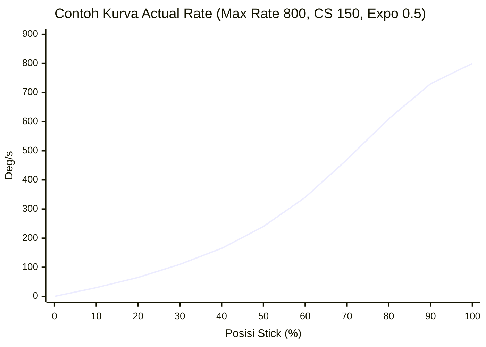

- **Kurva landai di tengah** = Expo tinggi → kontrol halus untuk cinematic/freestyle.
- **Kurva linear** = Expo 0 → respons sama di seluruh range → cocok racing.
- **Ujung curam** = Center Sensitivity rendah + Max Rate tinggi → snap di full stick.

#### Konversi Antar Sistem Rate

Jika Anda berasal dari sistem Betaflight Rates lama dan ingin pindah ke Actual Rates, gunakan Metamarc untuk:
1. Masukkan nilai BF Rates lama (RC Rate, Super Rate, Expo).
2. Lihat kurva yang dihasilkan.
3. Cocokkan dengan Actual Rates — atur CS dan Max Rate hingga kurvanya mirip.

> 💡 **Tips**: Racer biasanya pakai Max Rate 550–650 deg/s, Freestyle 850–1200 deg/s, Cinematic < 600 deg/s.

---

## 7. Step-by-Step: Tuning Filter

Tujuan: **gunakan filter sesedikit mungkin** untuk meminimalkan latency, tapi **cukup** agar motor tidak panas.

### 7.1 Urutan Filter

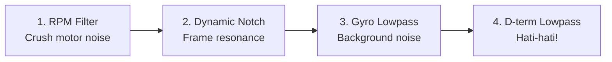

### 7.2 Step 1 — Aktifkan RPM Filter

**Wajib bagi semua build modern.**

1. Pastikan **Bi-directional DShot** aktif di tab Motor.
2. Test motor di tab Motor (tanpa propeler!) — error rate **E = 0%**.
3. Di PID Tuning → Filter Settings → centang **Gyro RPM Filter**.
4. Default: **3 harmonics**, **Min Frequency 100 Hz** — biasanya sudah optimal.

> Untuk build optimal: bisa dikurangi ke 2 harmonics dan Min Freq 130–160 Hz. Tapi **cek log Blackbox** apakah motor noise masih ter-filter.

### 7.3 Step 2 — Dynamic Notch Filter

Untuk frame resonance (biasanya 100–250 Hz).

1. Default Betaflight aman: **1 notch, Q 500**.
2. Jika punya Blackbox + PIDtoolbox:
   - Identifikasi frekuensi resonansi frame di heatmap.
   - Set **Min Freq** ~30 Hz di bawah resonansi.
   - Set **Max Freq** ~30 Hz di atas resonansi.
3. Tanpa Blackbox? **Biarkan default**.

### 7.4 Step 3 — Gyro Lowpass Filter

1. Geser slider **Gyro Filter Multiplier** sedikit ke kanan (1.0 → 1.2 → 1.4).
2. Test fly aggresif 30 detik.
3. Cek motor — kalau **panas berlebih**, kembalikan slider 1 step.

| PID Loop | Gyro Lowpass 2 Minimum |
|---|---|
| 2 kHz | 500 Hz (jangan disable!) |
| 4 kHz | 1000 Hz max |
| 8 kHz | Bisa disable jika tidak ada noise |

### 7.5 Step 4 — D-Term Lowpass Filter

⚠️ **D-term sangat sensitif noise** — hati-hati!

1. Geser slider **D Term Filter Multiplier** sedikit ke kanan (1.0 → 1.1 → 1.2).
2. Test fly 30 detik (acro moves).
3. Cek motor temperature setelah landing.
4. **Motor panas? Mundur 2 step!**

> 🚨 **JANGAN PERNAH disable D-Term Lowpass Filter** — motor bisa terbakar!

### 7.6 Yaw Lowpass

Default 100 Hz. **Biarkan saja** — minimal latency penalty.

### 7.7 Filter Strategy untuk Pemula (Tanpa Blackbox)

Jika tidak mau ribet dengan Blackbox:

1. Aktifkan **RPM filter** (default 3 harmonics, 100Hz).
2. Biarkan **Dynamic Notch** default.
3. Geser slider **Gyro Filter Multiplier** ke 1.2.
4. Geser slider **D Term Filter Multiplier** ke 1.0 (default) atau 1.1.
5. Test fly. Jika motor tidak panas dan terbang halus — selesai.

---

## 8. Step-by-Step: Tuning PID

Metode populer: **"Basement Tuning"** dengan PIDtoolbox + Blackbox. Tapi versi sederhana bisa pakai **slider tanpa Blackbox**.

### 8.1 Pilih Pendekatan

| Pendekatan | Cocok Untuk | Tools |
|---|---|---|
| **Slider only** | Pemula | Betaflight Configurator |
| **Basement Tuning + Blackbox** | Menengah/lanjut | PIDtoolbox, Blackbox Explorer |

### 8.2 Pendekatan Slider (Pemula)

#### Step 1: Reset & Persiapan
1. Di PID Tuning → klik **Restore Defaults** untuk profile aktif.
2. Pastikan filter sudah dituning (lihat Section 7).
3. Set **TPA Breakpoint = 1750** (sementara, untuk mencegah TPA mengaburkan oscillation).

#### Step 2: Test Default
Terbang dengan slider semua di posisi 1.0. Apakah:
- ✅ Stabil, motor tidak panas → tuning bisa dilanjutkan untuk performa lebih.
- ❌ Wobble/oscillate → ada masalah hardware/filter, jangan lanjutkan PID.

#### Step 3: Naikkan Master Multiplier Bertahap
1. Naikkan slider **Master Multiplier** 0.1 per step (1.0 → 1.1 → 1.2).
2. Test fly 30 detik tiap step.
3. Berhenti ketika:
   - Motor mulai panas, ATAU
   - Terdengar **thrilling oscillation** (suara getaran tinggi).
4. Mundur 1 step dari titik tersebut.

#### Step 4: P/D Balance (Damping Slider)
1. Jika overshoot saat flip → naikkan **Damping** (0.1 per step).
2. Jika respons terasa **lambat/sluggish** → turunkan **Damping**.

#### Step 5: Feedforward (Stick Response)
1. Default 1.0 biasanya bagus.
2. Jika stick terasa **lag** → naikkan ke 1.2 – 1.5.
3. Jika overshoot saat snap roll → turunkan.

#### Step 6: I Gain (Drift-Wobble)
1. Default 1.0 untuk 5".
2. Jika drone **drift** saat cruising → naikkan ke 1.2.
3. Jika terdengar **slow oscillation** → turunkan.

### 8.3 Pendekatan Basement Tuning (Lanjut)

> Asumsi: Anda sudah punya **PIDtoolbox** terinstall dan paham Blackbox basic.

```mermaid
flowchart TD
    Setup[Setup awal:<br/>FF=0, D Max=0, I=0.2,<br/>Damping=0.6 awal] --> Flight1[Flight 1: Damping 0.6]
    Flight1 --> Flight2[Flight 2: Damping 0.8]
    Flight2 --> Flight3[Flight 3: Damping 1.0]
    Flight3 --> Flight4[Flight 4: Damping 1.2]
    Flight4 --> Flight5[Flight 5: Damping 1.4]
    Flight5 --> Analisa1[Analisa Step Response<br/>di PIDtoolbox]
    Analisa1 --> PickPD[Pilih Damping<br/>dengan overshoot minimal<br/>+ latency rendah]

    PickPD --> Master1[Flight 1: Master 0.8]
    Master1 --> Master2[Flight 2: Master 1.0]
    Master2 --> Master3[Flight 3: Master 1.2]
    Master3 --> Master4[Flight 4: Master 1.4]
    Master4 --> MasterPick[Pilih Master tertinggi<br/>tanpa thrilling oscillation]

    MasterPick --> FF1[Test Feedforward:<br/>0.5, 1.0, 1.3, 1.5]
    FF1 --> FFPick[Pilih FF di mana<br/>gyro tepat di atas setpoint]

    FFPick --> IGain[Tuning I gain:<br/>biarkan 1.0 untuk 5"]
```

#### Detail Basement Method:

**Setup awal (PID Tuning page)**:
- Stick Response (FF) slider: **0**
- Dynamic Damping (D Max) slider: **0**
- Drift-Wobble (I) slider: **0.2**
- Damping (D) slider: **0.6** (5" drone)

**Flight Profile untuk Test (Rate Profile sementara)**:
- Center Sensitivity: 250
- Max Rate: 400
- Expo: 0.00

> Atau gunakan **Angle Mode** untuk lebih mudah (kalibrasi accelerometer dulu, set Angle strength = 100).

**Prosedur Flight per Test**:
1. Arm, hover.
2. Gerakkan stick roll & pitch terus-menerus selama **20–30 detik**.
3. Gerakan harus **besar** (full deflection ideal) dan **kontinu**.
4. Land, save log.

**Analisa di PIDtoolbox**:
1. Load semua log → **Step Response Tool** → Run.
2. Cari kurva dengan:
   - **Peak ≈ 1.0** (overshoot minimal, sedikit OK)
   - **Latency rendah**
3. Kurva itu = **Damping ideal**.

### 8.4 Tuning Yaw

Yaw biasanya tidak perlu banyak tuning.

1. Di PID Tuning, Slider Mode → ubah dari **RPY** ke **RP**.
2. Set Yaw P dan I langsung di angka:
   - 5" freestyle: P = 100, I = 100.
3. D-term Yaw biasanya **tidak dibutuhkan** — biarkan 0.

---

## 9. Pengaturan Lanjutan

### 9.1 Anti-Gravity (AG)

**Fungsi**: Boost I-term saat throttle berubah cepat → mencegah nose-dip saat punch out.

| Setting | Value |
|---|---|
| Default | 8 |
| 5" freestyle | 8 – 12 |
| Cinematic | 5 – 8 |

**Cara tune**: Jika ada wobble saat lepas throttle → turunkan AG. Jika nose-dip parah → naikkan.

### 9.2 Throttle Boost

**Fungsi**: Tambahan power saat throttle digerakkan cepat.

- Default: **5** (umum bagus).
- Throttle terasa **sulit diatur**? Turunkan ke 2–3.
- Racer puritan: **0** (predictable).

### 9.3 TPA (Throttle PID Attenuation)

**Fungsi**: Kurangi PID gain di throttle tinggi → mencegah oscillation.

- Default biasanya cukup.
- Jika ada oscillation di throttle tinggi (~1800):
  ```
  TPA = 0.75
  Breakpoint = 1750
  ```

### 9.4 Dynamic Idle

**Fungsi**: Jaga RPM motor minimum → mencegah ESC desync, perbaiki propwash, brake lebih kuat.

**Setup**:
1. Aktifkan Bi-directional DShot.
2. Set **Idle RPM**:
   - 5" → 25–40
   - 3" → 40–55
   - Whoop → 60–80
3. Disable **Static Motor Idle** otomatis.

### 9.5 Thrust Linearization

**Recommended setting: 20%**

**Manfaat**:
- Boost PID di throttle rendah (responsif saat cruising).
- Kurangi PID di throttle tinggi (anti-oscillation).
- Bagus untuk whoop & ESC 48 kHz PWM.

### 9.6 I-Term Relax

**Cutoff value**:
- Freestyle: default (15)
- Racing: 30
- Cinelifter / 7" long-range: 10

### 9.7 RC Smoothing — Auto Factor

| Auto Factor | Use Case |
|---|---|
| 20–25 | Racing |
| 30 | Default / Freestyle |
| 50 | Cinematic |
| 90 | Smooth cruising |
| 120 | Maximum smoothing (lag terasa) |

---

## 10. Troubleshooting Umum

### 10.1 Motor Panas

| Penyebab | Solusi |
|---|---|
| Filter terlalu sedikit | Naikkan Gyro/D-term filter slider |
| D gain terlalu tinggi | Turunkan Damping slider |
| Propeler bengkok | Ganti propeler |
| Frame resonance | Cek sekrup, gunakan Dynamic Notch |
| RPM filter mati | Aktifkan Bi-directional DShot + RPM filter |

### 10.2 Oscillation / Wobble

| Frekuensi | Penyebab |
|---|---|
| **< 20 Hz** | Drone reacting to stick (normal) |
| **20–100 Hz** | Propwash, PID terlalu tinggi, oscillation |
| **100–250 Hz** | Frame resonance, sekrup longgar |
| **> 250 Hz** | Motor noise, propeler |

### 10.3 Drone Drift saat Cruising

- Naikkan **I gain (Drift-Wobble slider)** sedikit.
- Cek apakah ada angin (wajar drift sedikit).
- Cek mounting gyro (jangan terlalu kencang).

### 10.4 Propwash (Wobble saat turun cepat)

- Aktifkan **Dynamic Idle**.
- Naikkan **D gain** sedikit (jika filter masih punya headroom).
- Aktifkan **Dynamic Damping (D Max slider)** ke 0.5–1.0.
- Periksa propeler — propwash makin parah dengan prop bengkok.

### 10.5 Feedforward Jitters

- **Matikan ADC Filter di radio** (System → Hardware).
- Load **RC Link Preset** yang benar di Betaflight.
- Naikkan **RC Smoothing Auto Factor** sedikit.

### 10.6 Gyro Defective

**Gejala**: Satu axis lebih noisy dari yang lain (cek di Blackbox spectrum).

**Diagnosa**: Putar FC 90° fisik → kalau noise mengikuti axis, gyro bermasalah.

**Solusi**:
- Tambah kapasitor low-ESR di power FC (220–470 µF).
- Pisahkan kabel power dari gyro.
- Ganti FC jika tidak teratasi.

---

## 11. Checklist Akhir & Tips Pro

### ✅ Checklist Sebelum Terbang

- [ ] Backup CLI (`diff all`) sudah disimpan.
- [ ] RPM Filter aktif (Bi-directional DShot work).
- [ ] Filter slider tidak terlalu kanan (cek motor temp).
- [ ] PID gain wajar (Master Multiplier ≤ 1.5 untuk 5").
- [ ] Failsafe terkonfigurasi.
- [ ] Battery alarm voltage terpasang.
- [ ] Propeler baru, balanced.

### 💡 Tips Pro

1. **Tuning satu drone → catat hasilnya**. Drone serupa bisa pakai setting awal yang sama.
2. **Test dengan battery baru/full**. Voltage berubah → respons berubah.
3. **Ganti battery setiap 2–3 flight test** untuk konsistensi.
4. **"Good enough" itu nyata**. Tidak ada tune sempurna — flying lebih banyak akan lebih meningkatkan skill daripada tuning terus-menerus.
5. **Hot motor test**: Setelah landing, sentuh bell motor. Kalau jari tidak tahan > 3 detik → motor terlalu panas, kurangi PID/filter.
6. **Dengarkan motor**. Suara "thrilling" / mendengung = oscillation. Stop tuning, mundur 1 step.

---

## 12. Analisa Blackbox — Panduan Lengkap

Blackbox adalah **flight data recorder** bawaan Betaflight — merekam sinyal gyro, PID, motor, setpoint, dan banyak lagi pada kecepatan hingga 2 kHz. Dengan menganalisa log ini, Anda bisa melihat **apa yang sebenarnya terjadi di dalam drone** secara matematis.

### 12.1 Mengapa Blackbox Penting?

| Tanpa Blackbox | Dengan Blackbox |
|---|---|
| Tuning berdasarkan "feeling" | Tuning berdasarkan data objektif |
| Susah mendiagnosis noise motor | Lihat spektrum noise secara visual |
| Tidak tahu apakah FF over/under | Bandingkan gyro vs setpoint langsung |
| Tebak-tebakan filter | Ukur delay filter dan noise floor |

### 12.2 Setup Blackbox (Wajib Sebelum Recording)

#### Konfigurasi di Betaflight Configurator (Tab Blackbox):

| Setting | Nilai yang Disarankan |
|---|---|
| **Logging Device** | Onboard Flash atau SD Card |
| **Logging Rate** | 2 kHz (atau 1.6 kHz untuk BMI270) |
| **Debug Mode** | `GYRO_SCALED` (merekam sinyal gyro mentah sebelum filter) |
| **Data Included** | Default OK; nonaktifkan GPS/Altitude jika hemat space |

#### CLI Commands Tambahan (Opsional):
```
set blackbox_sample_rate = 1/2    # rekam setiap 2 sample (hemat space)
set debug_mode = GYRO_SCALED      # aktifkan debug gyro unfiltered
```

### 12.3 Tools yang Dibutuhkan

| Tool | Fungsi | Link |
|---|---|---|
| **Blackbox Explorer** | Tampilkan log sebagai grafik waktu, analisis cepat | [github.com/betaflight/blackbox-log-viewer](https://github.com/betaflight/blackbox-log-viewer) |
| **PIDtoolbox (PTB)** | Analisis spektral mendalam, step response, compare multi-log | [github.com/bw1129/PIDtoolbox](https://github.com/bw1129/PIDtoolbox) |
| **Bucksaw** | Alternatif PTB berbasis web (WIP) | [bucksaw.koffeinflummi.de](https://bucksaw.koffeinflummi.de/) |

> ⚠️ PIDtoolbox versi terbaru berbayar. Versi gratis 0.65 masih tersedia di komunitas. Alternatif: **PIDscope** (fork Octave gratis) di [github.com/dzikus/PIDscope](https://github.com/dzikus/PIDscope).

### 12.4 Cara Download Log dari FC

**Via USB (Blackbox Explorer)**:
1. Sambungkan FC ke PC dengan USB.
2. Buka Blackbox Explorer → klik **Open Log File / Connect**.
3. Pilih flash memory atau SD card.
4. Download log ke komputer.

**Via SD Card**:
- Cabut kartu SD, baca langsung di PC.
- File bernama `LOG00001.BFL`, `LOG00002.BFL`, dst.

### 12.5 Membaca Log di Blackbox Explorer

```mermaid
flowchart LR
    BBE[Buka Blackbox Explorer] --> Open[Buka file .BFL]
    Open --> Trim[Trim log: tekan I dan O<br/>untuk set in/out point]
    Trim --> View{Pilih sinyal<br/>di panel kanan}
    View --> Gyro["Gyro" = sinyal sudah difilter]
    View --> GyroRaw["Gyro_Scaled" = sinyal mentah<br/>(hanya di Debug GYRO_SCALED)"]
    View --> SP["Setpoint" = target dari stick]
    View --> PSum["PIDsum" = output total PID"]
    View --> Motor["Motor[0-3]" = output ke motor"]
```

#### Panel Sinyal Penting:

| Sinyal | Arti |
|---|---|
| `gyroADC[0/1/2]` | Sinyal gyro **setelah filter** (roll/pitch/yaw) |
| `gyro_scaled[0/1/2]` | Sinyal gyro **sebelum filter** (debug mode) |
| `axisP[0/1/2]` | Kontribusi P-term per sumbu |
| `axisI[0/1/2]` | Kontribusi I-term |
| `axisD[0/1/2]` | Kontribusi D-term |
| `axisF[0/1/2]` | Kontribusi Feedforward |
| `setpoint[0/1/2]` | Target rotasi yang diinginkan (dari stick) |
| `motor[0/1/2/3]` | Output ke masing-masing motor (1000–2000) |
| `rcCommand[0/1/2/3]` | Perintah RC mentah dari receiver |

### 12.6 Analisa Noise Gyro (Filter Tuning)

#### Langkah 1: Rekam Throttle Sweep
Terbang maju minimal, lakukan **throttle sweep pelan** dari 0% ke 100% selama 5–10 detik. Ulangi 2–3 kali.

#### Langkah 2: Buka di PIDtoolbox → Spectral Analyzer

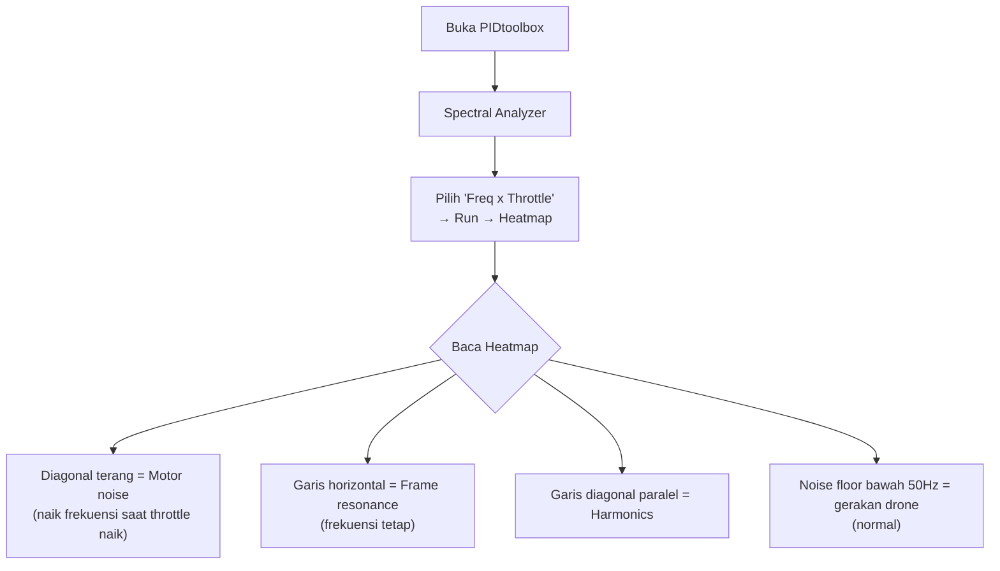

#### Interpretasi Frekuensi:

| Range Frekuensi | Sumber | Aksi |
|---|---|---|
| **< 20 Hz** | Gerakan drone normal | Jangan difilter |
| **20–100 Hz** | Propwash, PID oscillation | Hindari filter di sini (tambah delay, perburuk) |
| **100–250 Hz** | Frame resonance, komponen longgar | Dynamic Notch Filter |
| **> 250 Hz** | Motor noise, propeler | RPM Filter |

#### Target Noise Floor:
- **Gyro (post-filter)**: noise floor di atas 50 Hz idealnya **< -30 dB**
- **D-term (post-filter)**: idealnya **< -10 dB**

### 12.7 Analisa Step Response (PID Tuning)

Step Response adalah cara mengukur **seberapa baik drone mengikuti perintah stick** — apakah ada overshoot, undershoot, atau oscillation.

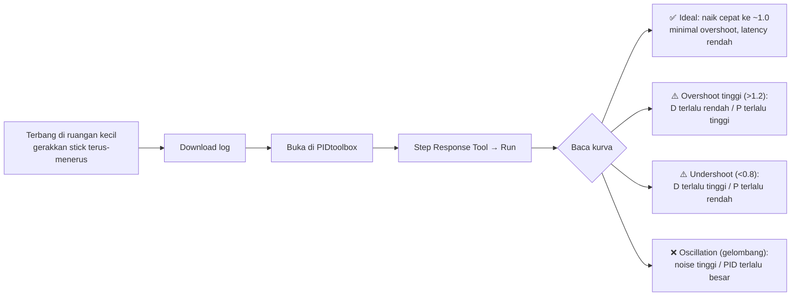

#### Membaca Kurva Step Response:

| Bentuk Kurva | Interpretasi | Solusi |
|---|---|---|
| Naik mulus ke ~1.0 | ✅ **Ideal** | Pertahankan |
| Naik ke > 1.2 lalu turun | Overshoot — D kurang | Naikkan Damping slider |
| Tidak sampai 1.0 (flat) | Undershoot — D berlebih | Turunkan Damping slider |
| Naik cepat tapi bergelombang | PID oscillation | Turunkan Master Multiplier |
| Kurva tidak stabil / acak | Noise tinggi | Perbaiki filter dulu |

### 12.8 Analisa Setpoint Tracking (Feedforward)

Digunakan untuk mengoptimalkan **Feedforward** — seberapa baik drone mengikuti input stick secara real-time.

**Di Blackbox Explorer**:
1. Tampilkan `setpoint[0]` dan `gyroADC[0]` bersamaan (roll axis).
2. Lakukan **snap roll** atau **flip** dan lihat grafik.

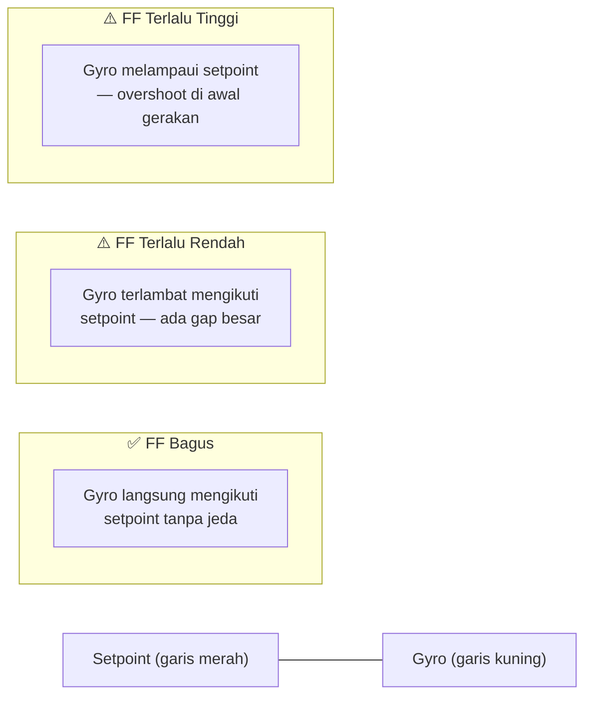

**Cara baca**:
- Gyro **tertinggal jauh** di belakang setpoint → **naikkan FF slider**.
- Gyro **melampaui** setpoint di awal gerakan → **turunkan FF slider**.
- Gyro **tepat di atas** setpoint → FF **optimal**.

### 12.9 Diagnosa Masalah via Blackbox

#### Motor Panas / Suara Kasar

1. Buka Blackbox Explorer.
2. Tampilkan `axisD[0]` (D-term roll).
3. **D-term trace sangat noisy/bergerigi** → D gain terlalu tinggi atau filter D-term kurang.

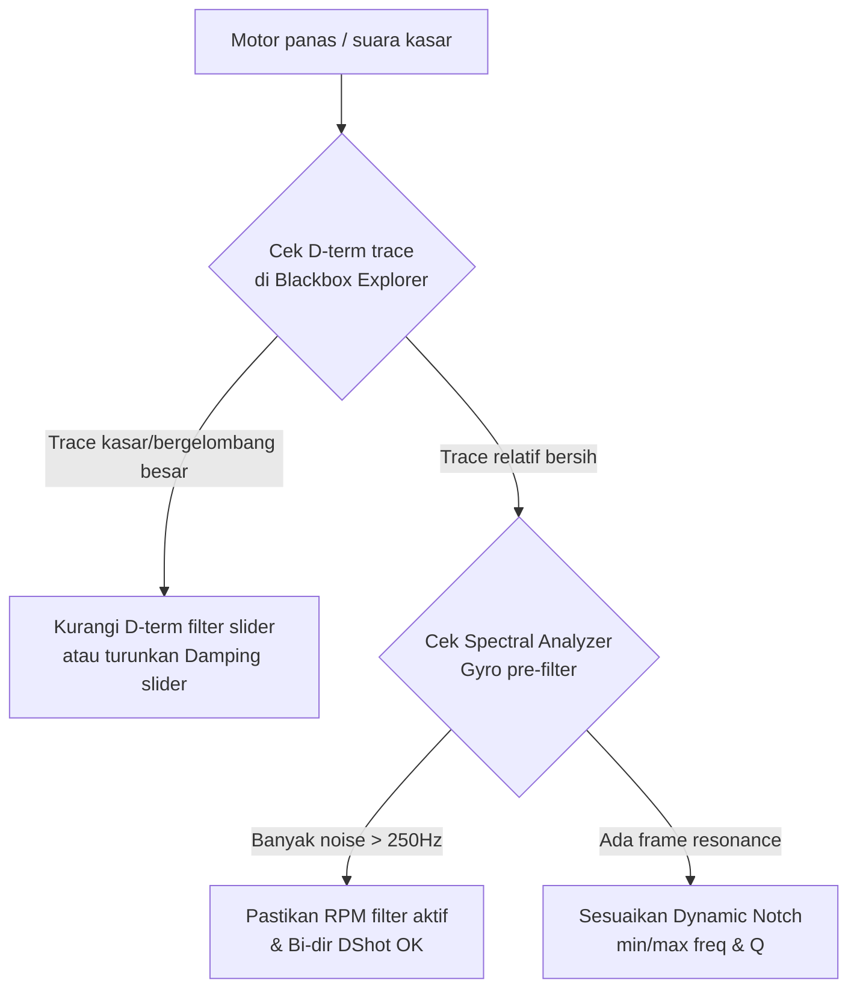

#### Propwash (Wobble saat turun cepat atau setelah flip)

1. Buka log, cari momen setelah flip saat throttle rendah.
2. Tampilkan `gyroADC[0]` dan `setpoint[0]`.
3. **Gyro berosilasi setelah setpoint berhenti** → propwash.
4. Indikasi di heatmap: noise di range 20–80 Hz saat throttle rendah.

**Solusi dari Blackbox**:
- Naikkan D-gain sedikit.
- Aktifkan Dynamic Idle.
- Kurangi D-term filter (jika aman, motor tidak panas).

#### Feedforward Jitter / Spike

1. Tampilkan `axisF[0]` (FF roll) dan `rcCommand[0]`.
2. **Lonjakan tiba-tiba di FF trace** meskipun `rcCommand` halus → masalah RC smoothing atau ADC filter radio.

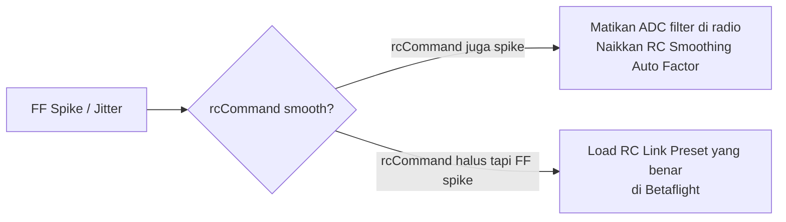

### 12.10 Workflow Blackbox Lengkap

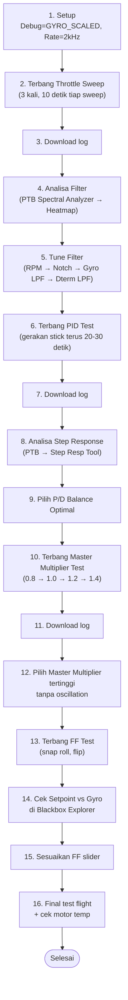

### 12.11 Tips Blackbox untuk Pemula

1. **Mulai dengan filter dulu**, bukan PID — log filter lebih mudah dibaca.
2. **Throttle sweep** adalah flight test paling informatif untuk filter.
3. **Trim log** di Blackbox Explorer sebelum analisis — buang takeoff/landing.
4. Ganti **battery setiap 2–3 flight** agar voltage tidak mempengaruhi hasil.
5. Beri nama log: `01_d06` (flight ke-1, Damping slider 0.6) agar mudah diorganisir.
6. **Cek motor temperature** setelah setiap sesi tuning — lebih reliable dari grafik.
7. Jika grafik terlihat aneh/acak → periksa build fisik dulu (sekrup longgar, prop rusak).

---

## 13. Glosarium

| Istilah | Arti |
|---|---|
| **PID** | Proportional, Integral, Derivative — algoritma stabilisasi |
| **Rate** | Kecepatan rotasi drone berdasarkan input stick (deg/s) |
| **Expo** | Kurva exponential untuk respons stick di tengah |
| **Feedforward (FF)** | Boost respons berdasarkan kecepatan input stick |
| **Filter** | Pembersih noise dari sinyal gyro |
| **Notch Filter** | Filter yang membuang frekuensi spesifik |
| **Lowpass Filter** | Filter yang membuang frekuensi tinggi |
| **RPM Filter** | Notch filter dinamis berbasis RPM motor (butuh Bi-Dir DShot) |
| **Dynamic Notch** | Notch filter berbasis FFT analisis real-time |
| **Setpoint** | Target rotasi yang diinginkan (dari stick) |
| **Gyro** | Sensor pengukur rotasi |
| **Oscillation** | Getaran tidak diinginkan (drone "berdengung") |
| **Propwash** | Turbulensi udara dari propeler sendiri saat turun cepat |
| **TPA** | Throttle PID Attenuation — kurangi PID di throttle tinggi |
| **Anti-Gravity** | Boost I saat throttle change cepat |
| **Blackbox** | Sistem logging data flight untuk analisis |
| **Blackbox Explorer** | Software resmi untuk membuka & menampilkan log Blackbox |
| **PIDtoolbox** | Software analisis Blackbox log untuk tuning (Step Response, Spectral Analyzer) |
| **Spektral Analyzer** | Alat analisis frekuensi noise di PIDtoolbox |
| **Step Response** | Kurva respons drone terhadap perubahan setpoint tiba-tiba |
| **Heatmap** | Visualisasi noise frekuensi vs throttle di PTB (freq x throttle) |
| **Noise Floor** | Level noise dasar di sinyal gyro (ideal < -30 dB) |
| **Setpoint** | Target rotasi yang diinginkan (dari stick) |
| **gyroADC** | Sinyal gyro setelah filter (di Blackbox Explorer) |
| **gyro_scaled** | Sinyal gyro sebelum filter / mentah (debug mode GYRO_SCALED) |
| **axisD** | D-term trace per sumbu di Blackbox |
| **axisF** | Feedforward trace per sumbu di Blackbox |
| **D Max / Dynamic Damping** | Boost D saat stick gerakan cepat |
| **DShot** | Protokol digital ESC (DShot300/600/1200) |
| **Bi-directional DShot** | DShot yang juga membaca RPM dari ESC |
| **ESC Desync** | Motor kehilangan sinkronisasi (suara aneh, hilang power) |

---

## 📚 Referensi & Bacaan Lanjut

- **Betaflight Wiki** — <https://betaflight.com>
- **Betaflight Rate Calculator** — <https://betaflight.com/docs/wiki/guides/current/Rate-Calculator>
- **Metamarc Rate Converter & Visualizer** — <https://rates.metamarc.com/>
- **Oscar Liang Rate Guide** — <https://oscarliang.com/rates/>
- **Oscar Liang PID/Filter Tuning** — <https://oscarliang.com/pid-filter-tuning-blackbox/>
- **Joshua Bardwell** (YouTube) — channel pembelajaran FPV
- **Chris Rosser** (YouTube) — tutorial PID tuning advanced
- **Blackbox Explorer (resmi)** — <https://github.com/betaflight/blackbox-log-viewer>
- **PIDtoolbox** — <https://github.com/bw1129/PIDtoolbox>
- **PIDscope (fork gratis)** — <https://github.com/dzikus/PIDscope>
- **Bucksaw (web-based)** — <https://bucksaw.koffeinflummi.de/>
- **Betaflight Configurator GitHub** — <https://github.com/betaflight/betaflight-configurator>

---

## Lampiran A: Ringkasan Validasi vs Sumber Resmi

Tabel berikut merangkum hasil cross-check setiap rekomendasi penting di panduan ini terhadap sumber terpercaya. Status `✅` berarti nilai/teknik di panduan **sesuai persis** dengan sumber; `📘` berarti merupakan praktik komunitas yang diterima luas.

### A.1 Setup Dasar & Hardware

| Item di Panduan | Nilai di Panduan | Sumber | Status |
|---|---|---|---|
| Logging device Blackbox | Onboard Flash / SD Card | Oscar Liang (BF 4.5) | ✅ |
| Logging Rate | 2 kHz (1.6 kHz untuk BMI270) | Oscar Liang (BF 4.5) | ✅ |
| Debug Mode | `GYRO_SCALED` | Oscar Liang (BF 4.5) | ✅ |
| ESC Protocol | DShot300 (4K loop), DShot600 (8K loop) | Oscar Liang (BF 4.5) | ✅ |
| Bi-directional DShot wajib untuk RPM filter | Ya | Oscar Liang + BF Docs | ✅ |
| Disable ADC filter di EdgeTX/OpenTX | Ya | Oscar Liang (BF 4.5) | ✅ |
| BLHeli_S → flash Bluejay untuk bi-dir DShot | Ya | Oscar Liang | ✅ |
| Kapasitor low-ESR ≥ 1000 µF di power input ESC | Ya | Oscar Liang | ✅ |

### A.2 Filter

| Item di Panduan | Nilai di Panduan | Sumber | Status |
|---|---|---|---|
| RPM Filter default harmonics | 3 | Oscar Liang (BF 4.5) | ✅ |
| RPM Filter default Min Frequency | 100 Hz | Oscar Liang (BF 4.5) | ✅ |
| RPM Filter Q value default | 500 (max 1000) | Oscar Liang (BF 4.5) | ✅ |
| Dynamic Notch Q default | 500 (boleh naik 600–700) | Oscar Liang (BF 4.5) | ✅ |
| Dynamic Notch (tanpa RPM filter, mis. whoop) | Q 350, 5 harmonics, min 100 Hz | Oscar Liang (BF 4.5) | ✅ |
| Min/Max freq Dynamic Notch | ±20–30 Hz dari resonance | Oscar Liang (BF 4.5) | ✅ |
| Gyro Lowpass 2 minimum 2K loop | 500 Hz | Oscar Liang (BF 4.5) | ✅ |
| Gyro Lowpass 2 minimum 4K loop | 1000 Hz | Oscar Liang (BF 4.5) | ✅ |
| Gyro Lowpass 2 untuk 8K | Bisa di-disable | Oscar Liang (BF 4.5) | ✅ |
| Yaw Lowpass | 100 Hz default (jangan diutak-atik) | Oscar Liang (BF 4.5) | ✅ |
| Frequency interpretation: <20 Hz, 20–100, 100–250, >250 | sesuai | Oscar Liang (BF 4.5) | ✅ |

### A.3 PID Tuning (Slider, Basement Method)

| Item di Panduan | Nilai di Panduan | Sumber | Status |
|---|---|---|---|
| Setup awal: FF = 0, D Max = 0, I = 0.2 | sesuai | Oscar Liang (BF 4.5) | ✅ |
| Damping awal 5" drone | 0.6 (test step 0.2) | Oscar Liang (BF 4.5) | ✅ |
| Damping range 5" akhir | 0.8 – 1.1 | Oscar Liang (BF 4.5) | ✅ |
| Damping range Tiny Whoop | 1.4 – 1.6 | Oscar Liang (BF 4.5) | ✅ |
| D gain 5" 6S vs 4S | 30s vs 40s | Oscar Liang (BF 4.5) | ✅ |
| Master Multiplier test step | 0.8, 1.0, 1.2, 1.4, 1.6, 1.8 | Oscar Liang (BF 4.5) | ✅ |
| Rate profile basement | Center 250, Max 400, Expo 0 | Oscar Liang (BF 4.5) | ✅ |
| Angle Mode strength untuk basement | 100 | Oscar Liang (BF 4.5) | ✅ |
| I gain slider 5" | 1.0 default OK | Oscar Liang (BF 4.5) | ✅ |
| Yaw P / I starter (5" freestyle) | 100 / 100, D = 0 | Oscar Liang (BF 4.5) | ✅ |

### A.4 Pengaturan Lanjutan

| Item di Panduan | Nilai di Panduan | Sumber | Status |
|---|---|---|---|
| Anti-Gravity default | 8 | Oscar Liang (BF 4.5) | ✅ |
| Anti-Gravity range 5" freestyle | 8 – 12 | Oscar Liang (BF 4.5) | ✅ |
| TPA Breakpoint saat tuning | 1750 (untuk hindari masking) | Oscar Liang (BF 4.5) | ✅ |
| TPA contoh akhir | 0.75, breakpoint 1750 | Oscar Liang (BF 4.5) | ✅ |
| Throttle Boost default | 5 | Oscar Liang (BF 4.5) | ✅ |
| Thrust Linearization | 20% | Oscar Liang (BF 4.5) | ✅ |
| Dynamic Idle 5" | 25 – 40 (RPM/100) | Oscar Liang (BF 4.5) | ✅ |
| I-term Relax cutoff freestyle | default (15) | Oscar Liang (BF 4.5) | ✅ |
| I-term Relax cutoff racing | 30 | Oscar Liang (BF 4.5) | ✅ |
| I-term Relax cutoff cinelifter / 7" LR | 10 | Oscar Liang (BF 4.5) | ✅ |
| RC Smoothing Auto Factor: Racing | 20 – 25 | Oscar Liang (BF 4.5) | ✅ |
| RC Smoothing Auto Factor: Freestyle | 30 (default) | Oscar Liang (BF 4.5) | ✅ |
| RC Smoothing Auto Factor: Cinematic | 50 | Oscar Liang (BF 4.5) | ✅ |
| RC Smoothing Auto Factor: Smooth Cruising | 90 | Oscar Liang (BF 4.5) | ✅ |
| PID Sum Limit boost | `set pid_sum_limit=1000` | Oscar Liang (BF 4.5) | ✅ |

### A.5 Rates

| Item di Panduan | Nilai di Panduan | Sumber | Status |
|---|---|---|---|
| Sistem rate yang direkomendasikan | Actual Rates | Oscar Liang | ✅ |
| Max Rate Cinematic | 600 – 800 deg/s | Oscar Liang | ✅ |
| Max Rate Freestyle | 800 – 1000 deg/s | Oscar Liang | ✅ |
| Max Rate Racing / LOS | 1000+ deg/s | Oscar Liang | ✅ |
| Center Sensitivity Cinematic | 50 – 150 | Oscar Liang | ✅ |
| Center Sensitivity Freestyle | 100 – 200 | Oscar Liang | ✅ |
| Center Sensitivity Racing/LOS | 150 – 250 | Oscar Liang | ✅ |
| Expo Cinematic | 0.6 – 0.8 | Oscar Liang | ✅ |
| Expo Freestyle | 0.5 – 0.7 | Oscar Liang | ✅ |
| Expo Racing | 0.4 – 0.6 | Oscar Liang | ✅ |

### A.6 Blackbox

| Item di Panduan | Sumber | Status |
|---|---|---|
| Workflow throttle sweep untuk filter | Oscar Liang (BF 4.5) | ✅ |
| Strategi: RPM Filter → Dynamic Notch → Gyro LPF → D-term LPF | Oscar Liang (BF 4.5) | ✅ |
| Target noise floor PIDtoolbox: < -30 dB di atas 50 Hz (gyro), < -10 dB (D-term) | Oscar Liang (BF 4.5) | ✅ |
| Penjelasan Step Response (Peak ≈ 1, latency rendah) | Oscar Liang (BF 4.5) | ✅ |
| Diagnosa gyro defective: putar FC 90° | Oscar Liang (BF 4.5) | ✅ |

### A.7 Catatan Edisi & Caveat

- Panduan ini ditulis untuk **Betaflight 4.5+** (BF 4.5.0 dirilis 28 Apr 2024). Beberapa fitur baru di 4.5 yang sudah disinggung: **TPA breakpoint untuk low throttle**, **dimmable RPM harmonics**, **EZ Landing**, **GPS Lap Timer**, **OSD Quick Menu**, **Lead-Lag Compensator**, **RPM Limiter**.
- Untuk versi BF lain, beberapa default & nama parameter bisa berubah (mis. di BF 4.4 nilai default Anti-Gravity berbeda dari era pre-4.4 — naik ~10×). Selalu cek release notes versi yang Anda pakai.
- Halaman dokumentasi tertentu di `betaflight.com/docs/wiki/...` (mis. profile-tuning-guide) mengembalikan 404 saat panduan ini divalidasi (Nov 2025). Sumber utama yang dipakai: **Oscar Liang** (otoritas komunitas, di-update Juni 2024 untuk BF 4.5) dan **release notes resmi Betaflight 4.5.0** di GitHub.
- PIDToolBox kini berbayar; **PIDscope** dan **Bucksaw** disebut sebagai alternatif gratis.

---

> 🛠️ Selamat tuning! Ingat: **drone yang terbang OK > drone yang sempurna di atas kertas**. Terbang sebanyak mungkin — itu yang akan paling meningkatkan kemampuan Anda. ✈️

---

<p align="center">
  📺 Dibuat oleh <strong>SkyfluxFPV</strong> · <a href="https://www.instagram.com/skyfluxfpv/">Instagram</a> · <a href="https://www.tiktok.com/@skyfluxfpv">TikTok</a><br/>
  <em>Follow untuk konten FPV</em>
</p>
