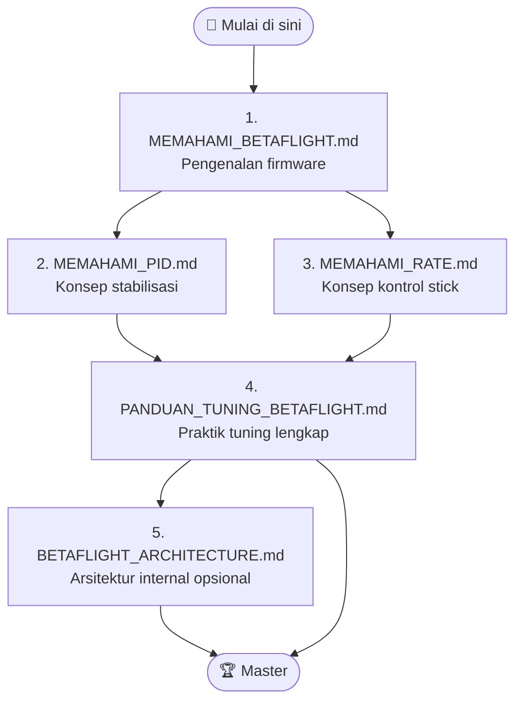

# 🚁 Memahami Betaflight — Belajar Tuning FPV

> Koleksi panduan **Bahasa Indonesia** untuk memahami dan tuning firmware **Betaflight** pada drone FPV.
> Dari konsep dasar untuk pemula sampai analisa Blackbox tingkat lanjut.

  <strong>📺 Dibuat oleh <a href="https://www.instagram.com/skyfluxfpv/">@skyfluxfpv</a></strong> 
  <a href="https://www.instagram.com/skyfluxfpv/">Instagram</a> · <a href="https://www.tiktok.com/@skyfluxfpv">TikTok</a>

---

## 📖 Tentang Repository Ini

Repository ini berisi 5 dokumen markdown yang disusun **terstruktur dari level pemula hingga lanjut**, dilengkapi diagram **Mermaid** untuk memperjelas konsep, contoh konkret, dan referensi dari sumber-sumber terpercaya komunitas FPV (Betaflight resmi, Oscar Liang, Joshua Bardwell, dll).

Cocok untuk:
- 🍼 **Pemula** yang baru terjun ke dunia FPV drone.
- 🎯 **Pilot menengah** yang ingin tuning drone sendiri.
- 🧑‍💻 **Developer** yang ingin memahami arsitektur internal Betaflight.

---

## 📚 Daftar Konten (Urutan Pembelajaran)

Disusun dari **konsep dasar → praktik tuning → arsitektur teknis**:

| # | File | Topik | Level | Estimasi Baca |
|:-:|---|---|:-:|:-:|
| 1 | [MEMAHAMI_BETAFLIGHT.md](MEMAHAMI_BETAFLIGHT.md) | Apa itu Betaflight? Pengenalan firmware, hardware, mode terbang, dan FAQ pemula. | 🍼 Pemula | ~10 menit |
| 2 | [MEMAHAMI_PID.md](MEMAHAMI_PID.md) | Apa itu PID? Penjelasan P/I/D dengan analogi pengemudi mobil, slider Betaflight, dan diagnosa gejala. | 🍼 Pemula | ~12 menit |
| 3 | [MEMAHAMI_RATE.md](MEMAHAMI_RATE.md) | Apa itu Rate? 3 parameter Actual Rates (Center Sensitivity, Max Rate, Expo) dengan contoh konkret. | 🍼 Pemula | ~10 menit |
| 4 | [PANDUAN_TUNING_BETAFLIGHT.md](PANDUAN_TUNING_BETAFLIGHT.md) | Panduan lengkap tuning step-by-step: persiapan hardware, Rate, Filter, PID, Blackbox analysis, troubleshooting. | 🎯 Menengah – Lanjut | ~45 menit |
| 5 | [BETAFLIGHT_ARCHITECTURE.md](BETAFLIGHT_ARCHITECTURE.md) | Arsitektur internal Betaflight: struktur source code, scheduler, task system, sensor pipeline, motor mixer. | 🧑‍💻 Developer | ~30 menit |

> 💡 **Saran urutan baca:** Mulai dari **#1 → #2 → #3** (konsep dasar), lalu **#4** saat siap praktik tuning. **#5** opsional untuk yang ingin memahami kode Betaflight.

---

## 🗺️ Peta Pembelajaran

---

## 🎯 Apa yang Akan Kamu Pelajari?

- ✅ Apa itu Betaflight & cara kerjanya
- ✅ Konsep PID dan kenapa penting untuk drone stabil
- ✅ Cara setting Rate yang nyaman sesuai gaya terbang
- ✅ Workflow lengkap tuning: hardware check → Rate → Filter → PID
- ✅ Cara baca log Blackbox dengan PIDtoolbox & Blackbox Explorer
- ✅ Troubleshooting masalah umum (motor panas, oscillation, propwash)
- ✅ Arsitektur source code Betaflight (untuk developer)

---

## 🔗 Sumber Referensi

Semua konten disusun dengan merujuk pada sumber terpercaya komunitas FPV:

- 🌐 **Betaflight Official** — <https://betaflight.com>
- 📦 **Betaflight GitHub** — <https://github.com/betaflight/betaflight>
- 📰 **Betaflight 4.5 Release Notes** — <https://github.com/betaflight/betaflight/releases/tag/4.5.0>
- 📐 **Betaflight Rate Calculator** — <https://betaflight.com/docs/wiki/guides/current/Rate-Calculator>
- 📘 **Oscar Liang Tutorials** — <https://oscarliang.com/category/betaflight/>
- 🎥 **Joshua Bardwell** (YouTube) — channel pembelajaran FPV
- 🎥 **Chris Rosser** (YouTube) — tutorial PID tuning lanjut
- 💬 **IntoFPV Forum** — <https://intofpv.com>

---

## 🛠️ Tools yang Disebutkan

| Tool | Fungsi | Link |
|---|---|---|
| Betaflight Configurator | Setup drone via USB | <https://github.com/betaflight/betaflight-configurator/releases> |
| Blackbox Explorer | Baca log Blackbox | <https://github.com/betaflight/blackbox-log-viewer> |
| PIDtoolbox | Analisa PID & Filter (Matlab) | <https://github.com/bw1129/PIDtoolbox> |
| PIDscope | Fork PIDtoolbox (Octave, gratis) | <https://github.com/dzikus/PIDscope> |
| Bucksaw | Web-based blackbox analyzer | <https://bucksaw.koffeinflummi.de/> |

---

## 📝 Versi Betaflight yang Dibahas

Konten dalam repository ini di-validasi terhadap **Betaflight 4.5.x** (versi stabil terbaru saat dokumen ditulis). Untuk versi yang lebih lama atau lebih baru, beberapa default & nama parameter mungkin berbeda — selalu cek release notes versi yang kamu pakai.

---

## ⚠️ DISCLAIMER

> 🚨 **PENTING — Baca sebelum menggunakan panduan ini!**

1. **Bukan dokumentasi resmi.** Repository ini adalah karya independen yang merangkum & menerjemahkan konsep dari berbagai sumber publik. Untuk informasi resmi & terbaru, selalu rujuk ke <https://betaflight.com> dan <https://github.com/betaflight/betaflight>.

2. **Risiko tuning sepenuhnya tanggung jawab pilot.** Tuning yang salah dapat menyebabkan:
   - Drone tidak terbang stabil
   - Motor terbakar
   - Crash, kerusakan property, atau cedera
   - Kerusakan flight controller

3. **Selalu lepas propeler** saat melakukan konfigurasi atau pengetesan motor di meja kerja.

4. **Backup CLI dump** (`diff all`) sebelum mengubah pengaturan apa pun. Backup adalah jaring pengaman jika terjadi kesalahan.

5. **Patuhi regulasi setempat.** Penerbangan drone FPV diatur oleh peraturan setiap negara/wilayah. Pilot wajib:
   - Mengetahui zona terbang (no-fly zone, bandara, tempat umum)
   - Memiliki izin/registrasi yang diperlukan
   - Tidak mengganggu privasi orang lain
   - Tidak terbang di atas kerumunan

6. **Test di simulator** (Liftoff, Velocidrone, TRYP FPV, dll) sebelum terbang sungguhan, terutama untuk pemula.

7. **Gunakan failsafe** dan terbang di area yang aman & terbuka.

8. **Penulis & kontributor TIDAK bertanggung jawab** atas kerugian, kerusakan, atau cedera yang timbul akibat penggunaan informasi dalam repository ini. Konten disediakan **"as-is"** untuk tujuan **edukasi**.

9. **Trademarks & merk dagang** ("Betaflight", logo, nama produk yang disebut) adalah milik pemegangnya masing-masing. Repository ini tidak berafiliasi dengan tim Betaflight resmi.

10. **Konten edukasi non-komersial.** Semua tutorial, gambar konsep, dan referensi dipakai dalam konteks **fair use** untuk pembelajaran. Jika ada keluhan hak cipta, hubungi pemilik repository untuk koreksi.

---

## 🤝 Kontribusi

Kontribusi sangat diterima! Jika kamu menemukan:
- 🐛 Kesalahan teknis / nilai parameter yang outdated
- ✏️ Typo atau bahasa yang membingungkan
- 💡 Saran perbaikan struktur atau diagram

Silakan buka **Issue** atau kirim **Pull Request** di repository ini.

---

## 📜 Lisensi & Atribusi

Konten **asli** dalam repository ini (tulisan, diagram Mermaid, struktur panduan) dirilis di bawah lisensi **Creative Commons Attribution 4.0 International (CC BY 4.0)** — bebas digunakan, dibagikan, dan dimodifikasi untuk tujuan apapun (termasuk komersial), **selama mencantumkan kredit** kepada **SkyfluxFPV**.

Detail lisensi: <https://creativecommons.org/licenses/by/4.0/>

### Cara Memberi Kredit

Jika kamu menggunakan/membagikan konten dari repository ini, mohon sertakan atribusi seperti contoh:

> Sumber: SkyfluxFPV — Memahami Betaflight & Belajar Tuning FPV
> Instagram: @skyfluxfpv · TikTok: @skyfluxfpv
> https://github.com/edhotp/Memahami-Betaflight-Belajar-Tuning-FPV

### Konten Pihak Ketiga

Kutipan, gambar, atau referensi dari sumber lain (Oscar Liang, dokumentasi Betaflight, Joshua Bardwell, dll) **tetap menjadi hak cipta pemiliknya masing-masing** dan dipakai dalam konteks **fair use** untuk tujuan edukasi. CC BY 4.0 hanya meng-cover konten asli SkyfluxFPV.

---

## 🌟 Quote Penutup

> *"Spend more time flying, that's how you know whether your quad flies good or not. Graphs are just graphs after all."*
> — **Oscar Liang**

> 🚁 **Selamat belajar dan selamat terbang!**
> Tuning yang baik dimulai dari pemahaman konsep, bukan dari mencontek angka pilot lain. 🎯

---

  <strong>Dibuat dengan ❤️ oleh SkyfluxFPV</strong> 
  📷 <a href="https://www.instagram.com/skyfluxfpv/">Instagram @skyfluxfpv</a> · 🎵 <a href="https://www.tiktok.com/@skyfluxfpv">TikTok @skyfluxfpv</a> 
  <em>Follow untuk konten FPV, build, dan tutorial lainnya!</em>

